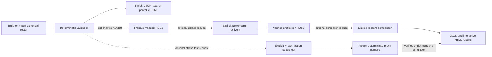
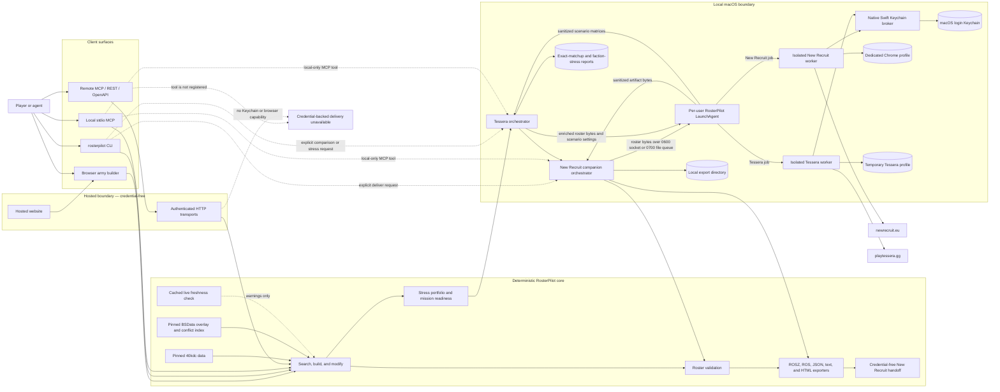
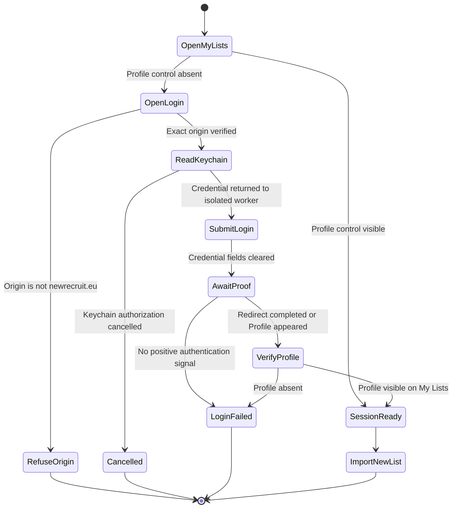
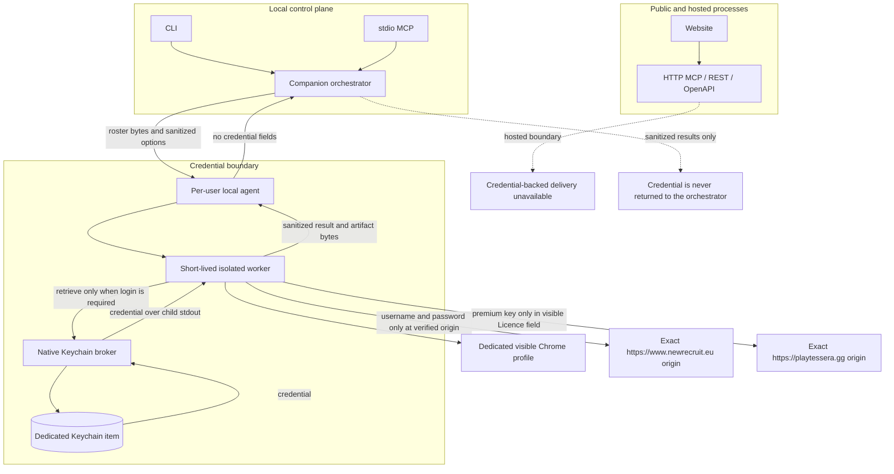

# RosterPilot architecture

RosterPilot is a deterministic Warhammer 40,000 roster engine exposed through
web, CLI, MCP, and REST surfaces. The roster engine and pinned data remain the
source of truth. New Recruit is an optional local delivery and Pretty HTML
backend, not the canonical validator. The task-oriented entry points and
commands are documented in the [workflow guide](workflows.md).

## Capability model

Roster construction and New Recruit interoperability are deliberately separate
capabilities:

| Capability | Coverage | Authority |
| --- | --- | --- |
| Search, build, modify, validate, explain | All 35 embedded faction entries | Pinned `40kdc-data` units, detachments, pricing, loadouts, and army checks |
| Printable HTML, text, roster JSON, New Recruit-shaped JSON | Every validated roster | RosterPilot serializers |
| `.ros/.rosz` import | Any roster whose selected BSData configuration, units, models, and wargear are mapped without a blocking conflict | Generated, versioned catalogue references |
| New Recruit import, enriched `.rosz`, and Pretty HTML automation | Same per-roster gate as `.rosz` | Local macOS companion |
| Tessera handoff and experimental matchup matrix | Verified New Recruit-enriched rosters | Local temporary browser adapter |
| Known-faction stress testing | A validated player roster plus deterministic legal, exportable faction proxies within points tolerance | Shared portfolio and mission-readiness core, local New Recruit enrichment, and local Tessera adapter |

### Workflow composition

Capabilities compose, but user workflows never continue implicitly. A legal
canonical roster can be the final result, an input to a file export, an input
to an explicitly requested New Recruit delivery, the player side of an exact
Tessera comparison, or the player side of a known-faction stress test.



The dotted edges are explicit choices, not automatic transitions. Tessera has
a technical dependency on New Recruit enrichment, but creating or exporting a
roster does not trigger that dependency. Exact comparison and faction stress
testing are also separate explicit choices. Comparison suggestions never
mutate a canonical roster.

Space Marine chapter entries inherit the parent Adeptus Astartes unit pool while
retaining their chapter detachments, faction exclusions, and validation
context. Missing or ambiguous data fails closed for New Recruit exports;
generic building never implies that every possible selection in that faction
is mapped.

### Pinned data and New Recruit compatibility

[New Recruit](https://www.newrecruit.eu/) states that it consumes community
catalogues from the [BSData GitHub organization](https://github.com/BSData).
RosterPilot therefore consumes the public
[`BSData/wh40k-11e`](https://github.com/BSData/wh40k-11e) repository at an
exact commit. It does not scrape the New Recruit UI or call private APIs.

`data/sources.json` is the reviewed release manifest. It pins the rules package,
the BSData branch and commit, and the official Munitorum Field Manual app
version and content hash. `scripts/sync-bsdata.ts` resolves catalogue imports,
configuration trees, units, models, wargear, and enhancements, then writes the
deterministic `data/generated/new-recruit-catalogues.json` overlay.

Roster export decomposes each validated unit-wide equipment bag with the same
exact model-composition solver used by `40kdc-data` legality checks. The shared
New Recruit resolver then maps each leader, regular model, specialist, and
loadout variant to one BSData model entry. Catalogue generation runs every
deterministic base loadout through that resolver and separately indexes legal
equipment absent from BSData, so preflight and runtime export cannot disagree
about a selection they both claim to support.

The rules engine remains authoritative for construction and validation. BSData
is authoritative for New Recruit identifiers and is a cross-check for points
and loadouts. A disagreement becomes a structured conflict:

- roster validation warns about conflicts affecting selected units;
- `.ros/.rosz` and automated delivery block when a selected reference is
  missing, ambiguous, or conflicting;
- printable and canonical JSON exports remain available for a legal roster;
- unresolved mappings are never guessed.

Each V2 roster stores the complete release provenance. V1 roster JSON is
migrated on read and marked with incomplete historical provenance.

### Tessera boundary

Tessera is not a rules authority or roster validator. RosterPilot imports and
verifies the canonical roster in New Recruit, downloads New Recruit's
profile-rich `.rosz`, and treats that archive as the stable handoff contract.
The optional Tessera adapter runs only through local stdio MCP or CLI in a
temporary Chrome profile. It does not call private APIs or read browser
storage. The orchestrator never handles premium keys: only the short-lived
worker may retrieve the dedicated Keychain item, and it enters that key only
after verifying the exact Tessera origin and locating its visible Licence key
field.

An exact-list full analysis captures 16 raw scenarios per opponent: two phases,
four metrics, and both directions. Quick mode captures Shooting wipe
probability in both directions. The adapter confirms each visible phase and
metric selection, records the iteration count and settings, maps repeated unit
names to stable roster instances, and consolidates metric matrices into
phase/direction scenarios.

A known-faction stress test freezes a deterministic proxy portfolio before any
browser work. `core-3` attempts balanced-control, ranged-pressure, and
assault-pressure lists with mixed composition. `diverse-9` crosses those three
postures with mixed, mass, and elite-heavy compositions. Proxies must be legal,
New Recruit-exportable, within the same 5% points tolerance, and distinct by a
simulation-payload fingerprint over units, models, equipment, enhancements, and
only modeled rules. Detachment-only differences do not count. `core-3` requires
three unique proxies and all postures. `diverse-9` targets nine but may proceed
with six to eight unique proxies only when all postures remain represented;
weights are renormalized and the status is capped at `degraded`. Mixed, mass,
and elite-heavy compositions have explicit role, body-share, elite-share, and
model-count bounds. Named anchors are deliberately evaluated where legal.
Available proxies have equal analytical weight; they are coverage cases, not an
empirical distribution of tournament lists.

The explicit full-loop adapter first builds with structured opponent context
and mixed-threat intent, runs a bounded deterministic repair, then stops unless
the roster uses at least 98% of its points and has no red overall mission
readiness result. The escape hatch is explicit. It assigns a stable descriptive
name and never applies post-simulation changes.

Stress preflight validates the player, locally verifies `.rosz` export for all
available proxies, reserves report and manifest paths, and scans known
multi-profile equipment before starting an external action. Unresolved choices
produce a policy scaffold and `TESSERA_PROFILE_POLICY_REQUIRED`; no list is
delivered. A `ProfilePolicyV1` entry binds faction, unit, weapon group, phase,
selected profile, and active count. The enriched archives are checked against
the complete inventory and the policy's canonical SHA-256 is frozen into the
execution fingerprint, manifest, report provenance, and paired revision.

The default staged strategy screens every available proxy with half-wipe
probability for both phases and directions, then selects three frozen
representatives—stress, central, and contrast—for the other three metrics. A
complete `diverse-9` staged run captures 72 raw scenarios. `full-all` applies
all four metrics to every proxy, producing 144 raw scenarios for a complete
suite. Tessera simulation still requires an explicit `experimental` option;
without it, the orchestrator returns prepared handoffs and a partial report
without inferred cells.

Stress report and manifest schema v2 record the player fingerprint and data
pin, profile-policy hash, opponent faction, frozen portfolio, configuration,
prepared-artifact hashes, representative selection, and every stage's status,
attempt count, timestamps, structured error, retryability, next action, report
path, and content hash. Resume revalidates identity, requested cells, exact
profile policy, and hashes. V1 manifests are migrated in memory and rewritten
as v2 only on resume. V1 paired baselines without exact profile provenance are
rejected. Transient entries receive at most three automatic attempts with
one- and three-second backoff and five lifetime attempts through explicit
resume; terminal errors require an explicit forced retry.

Before any New Recruit delivery, the manifest persists an in-progress marker.
The verified receipt and enriched-file hash replace it after delivery. If the
process stops in that narrow interval, resume reports an unknown external
outcome and fails closed instead of risking a duplicate list. Resume also
rejects a changed fingerprint, data pin, faction, suite, strategy, or
simulation setting. This prevents a resumed result from silently mixing
incomparable runs.

Matchups at or below a 5% difference relative to the player's points limit are
classified as matched. Exact opponents outside that inclusive tolerance fail
closed unless `allowPointMismatch` is explicit; an overridden report is
classified as unmatched and cannot produce roster-change candidates.
Out-of-tolerance generated archetypes are omitted.

Schema-v2 reports retain visible Tessera settings, import warnings, structured
findings with cell-level evidence, and up to three validated single-operation
change candidates for matched comparisons. Candidates never mutate a roster.
Import issues carry side, unit, weapon group, phase, and profile choices; only
the affected attacking unit's cells are ambiguous.
After explicit approval, `compare_roster_revision` validates a same-faction
revision, reuses the baseline opponents and configuration, and records
improved, worsened, unchanged, or ambiguous cell deltas.

Faction stress reports are schema v2. `partial` means required preparation or
simulation work is missing and takes precedence over confidence problems.
`inconclusive` means capture completed but confidence or posture coverage is
insufficient. `degraded` requires at least six confident unique `diverse-9`
proxies across all postures and three complete deep dives. `complete` requires
all nine; `core-3` requires its three. Missing estimates are `null`, while
below-threshold observations live in a separate `provisional` structure with
explicit point coverage. Reports summarize directional combat robustness,
never whole-game win probability. Mission readiness remains separate.

After explicit approval, `compare_stress_test_revision` requires the same
player faction, points limit, and pinned data release. It reuses the exact
baseline enriched proxy files, portfolio, analysis strategy, simulator
configuration, and representative selections; it never regenerates or
reselects the opposing suite. Before revised-player delivery it verifies every
proxy's execution fingerprint and SHA-256 content hash. After the rerun it
requires identical recorded settings and iteration counts for each exact
phase/metric/direction scenario, not merely matching stage-level totals. Margin
changes smaller than one percentage point are classified as unchanged. The
paired conclusion uses the screening half-wipe robustness deltas; deep-dive
wipe, kill, and damage results remain supporting evidence. The conclusion is
suppressed if the mission-readiness guardrail detects a regression.

If UI automation is disabled or an individual Tessera run fails, verified
enriched artifacts remain usable and the report is `partial`, with missing
scenarios and warnings kept visible. Reports describe modeled damage
efficiency and unit threats, never a whole-game win probability. Hosted MCP,
REST, OpenAPI, and the public website do not register exact-matchup or
stress-test browser tools. Faction stress testing is available only through
the terminal CLI and local stdio MCP; there is no public stress-test UI.

Verified New Recruit artifacts are stored in a local content-addressed cache
keyed by execution fingerprint and pinned source data. Reuse requires both the
file hash and exact enriched summary to match. Remote list URLs are retained in
a local run inventory and are never deleted automatically. A stress run also
reuses one isolated Tessera browser-session state across its proxy requests;
the local agent removes it at completion or after a 30-minute expiry. Premium
unlock retains the key through a bounded positive-state poll, and absence,
rejection, timeout, still-locked UI, missing/stale matrix, and incomplete
scenario failures have distinct codes.

### Freshness policy

Reproducibility and freshness are separate checks. An army is always built from
the exact pinned release; a live source check never changes points in the
middle of a build.

- MCP and authenticated REST builds check the npm package, BSData branch head,
  and official points app through a 15-minute cache.
- The browser checks the same server-side freshness endpoint on startup and
  after generating an army.
- `check_data_freshness` and `rosterpilot freshness` expose an explicit live
  check.
- A daily GitHub workflow prepares a reviewable pull request when a source
  changes. It regenerates the overlay and runs the data acceptance checks; it
  does not merge itself.

## System architecture



The hosted website and HTTP transports never receive New Recruit credentials
and cannot invoke the local browser worker. Terminal CLI and local stdio MCP
send high-level jobs to the per-user agent. Sandboxed clients fall back to an
atomic, per-user file queue under `/private/tmp`; neither transport has a
credential-retrieval operation.

## Roster delivery workflow

Automated delivery is a non-idempotent external action. It runs only after an
explicit request to upload, import, or send a roster to New Recruit.

```mermaid
sequenceDiagram
    autonumber
    actor User
    participant Client as CLI or local MCP
    participant Core as RosterPilot core
    participant Companion as Local companion
    participant Worker as Isolated worker
    participant Broker as Keychain broker
    participant Keychain as macOS Keychain
    participant Chrome as Dedicated Chrome
    participant NR as New Recruit
    participant Disk as Export directory

    User->>Client: Deliver this roster to New Recruit
    Client->>Core: Validate canonical roster draft
    alt Roster is invalid
        Core-->>Client: Violations and warnings
        Client-->>User: Stop before browser launch
    else Roster is valid
        Core-->>Companion: Validated roster and expectations
        Companion->>Core: Generate ROSZ in private temp directory
        Companion->>Companion: Preflight paths and file collisions
        Companion->>Worker: ROSZ path plus expected name, faction, points, and units
        Worker->>Chrome: Open My Lists in dedicated profile

        alt Authenticated Profile control is visible
            Chrome-->>Worker: Reuse authenticated session
        else Session is unverified or anonymous
            Worker->>Broker: Retrieve configured credential
            Broker->>Keychain: Restricted generic-password read
            Keychain-->>Broker: Credential
            Broker-->>Worker: Credential in worker memory only
            Worker->>NR: Submit only on exact newrecruit.eu origin
            NR-->>Worker: Redirect or authenticated Profile control
            Worker->>Worker: Clear credential fields in memory
        end

        Worker->>NR: Import ROSZ as a new list
        NR-->>Worker: New row or list URL
        Worker->>NR: Open imported list
        Worker->>Worker: Verify name, faction, points, and every unit count

        alt Verification fails
            Worker-->>Companion: Mismatch plus preserved list URL
            Companion-->>Client: Fail closed; do not delete or modify the list
        else Verification succeeds
            opt Pretty HTML requested
                Worker->>NR: Export, Pretty, Save as HTML
                NR-->>Worker: HTML download
                Worker->>Worker: Verify non-empty download
            end
            Worker-->>Companion: Sanitized result and artifact paths
            Companion->>Disk: Move ROSZ and HTML with no-overwrite rules
            Companion-->>Client: List URL, verification, artifacts, and warnings
            Client-->>User: Completed delivery
        end
    end
```

## Authentication state machine

RosterPilot proves authentication positively. The absence of a login form is
not enough because New Recruit supports anonymous local lists. A session is
reusable only when the authenticated `Profile` control is visible.



## Trust boundaries and secret flow



Security invariants:

- Credentials are collected only by the native secure dialog.
- Credentials never appear in CLI arguments, environment variables, MCP
  payloads, logs, screenshots, diagnostics, or exported files.
- Only the isolated worker invokes the broker's credential retrieval command.
- The local-agent protocol accepts roster jobs and status checks, never a raw
  credential retrieval request.
- The New Recruit worker enters credentials only after exact-origin
  verification. The Tessera worker similarly enters the premium key only into
  Tessera's visible Licence key field on the exact Tessera origin.
- The automation does not inspect cookies or browser storage and does not call
  private New Recruit APIs.
- Login pages are never captured in screenshots.
- Hosted transports do not expose credential-backed delivery tools.

## Component map

| Component | Responsibility | Primary source |
| --- | --- | --- |
| Roster engine | Search, build, modify, validate, explain, export | `lib/rosterpilot/` |
| Catalogue generator | Pin and reconcile BSData identifiers, coverage, and conflicts | `scripts/sync-bsdata.ts` |
| Freshness monitor | Compare pins with npm, BSData, and the official MFM app | `lib/rosterpilot/freshness.ts` |
| Stress-test core | Generate deterministic faction portfolios, structural fingerprints, and mission-readiness guardrails | `lib/rosterpilot/stress-portfolio.ts`, `lib/rosterpilot/mission-readiness.ts` |
| Local CLI | Terminal commands and local file operations | `cli/rosterpilot.ts` |
| MCP server | Shared roster tools plus conditionally registered local tools | `mcp/server.ts` |
| Local stdio MCP | Injects local file writers and macOS companion | `mcp/stdio.ts` |
| Per-user local agent | Cross-process queue, provider status, checkout identity, and secret-free roster job transport | `local/agent/server.ts` |
| Companion orchestrator | Validation, collisions, local-agent requests, and artifact publication | `local/new-recruit/companion.ts` |
| Browser adapter | Authentication, import, verification, Pretty export | `local/new-recruit/browser.ts` |
| Tessera orchestrator | Exact matchups, matched-points policy, scenario consolidation, findings, candidates, and exact-list revision deltas | `local/tessera/companion.ts` |
| Faction stress orchestrator | Preflight, delivery reuse, staged execution, resume manifests, robustness aggregation, and frozen paired revisions | `local/tessera/stress.ts`, `local/tessera/stress-analysis.ts` |
| Tessera UI and reports | Visible simulator control/extraction plus exact-matchup and faction-stress HTML rendering | `local/tessera/browser.ts`, `local/tessera/report.ts`, `local/tessera/stress-report.ts` |
| Isolated worker | Holds credentials in memory and returns sanitized results | `local/new-recruit/worker.ts` |
| Keychain broker | Native secure configuration and restricted credential access | `native/NewRecruitKeychainBroker.swift` |
| Hosted API | Credential-free REST and remote handoff | `app/api/v1/[...path]/route.ts` |
| Browser UI | Local draft history and credential-free exports | `app/page.tsx` |

## Installation and deployment boundaries

| Surface | Installation unit | Portability and durability rule |
| --- | --- | --- |
| Core engine, CLI, and stdio MCP | Complete Git checkout plus locked Node dependencies | Supported on macOS, Linux, and Windows; direct dependencies and package scripts must remain platform-neutral |
| Hosted website, REST, and HTTP MCP | Validated Cloudflare-compatible build | Uses only credential-free core capabilities and never imports local automation modules into a hosted tool contract |
| New Recruit and Tessera automation | Per-user macOS LaunchAgent, installed broker, and one complete checkout | Setup records the exact checkout and Node executable; status rejects a running agent from another checkout or protocol version |
| Roster and report artifacts | Caller-selected directory | Writes stay inside the current directory by default and never overwrite without explicit approval |

The LaunchAgent intentionally runs reviewed worker code from the checkout that
installed it, while the native broker is copied into per-user application
support. Moving the repository or changing the Node installation requires
rerunning the selected setup profile. Protocol and checkout identity checks
turn that condition into an actionable failure instead of allowing a newer CLI
to call stale background code.

The repository CI verifies the locked install on macOS, Linux, and Windows and
runs lint, tests, a production build, rendered-output checks, and deterministic
catalogue regeneration before changes are considered ready.

## Failure behavior

The companion fails closed:

- invalid rosters stop before Chrome opens;
- a local agent installed from another checkout or protocol version is rejected
  with a reinstall instruction;
- missing companion, browser, or credential stops before import;
- unverified authentication stops before import;
- changed selectors or import failures return explicit error codes;
- exact Tessera opponents outside the 5% points tolerance stop unless the
  caller explicitly allows an unmatched directional analysis;
- stress testing completes local validation, mapping preflight, and output-path
  reservation before browser activity; fewer than three unique `core-3` or six
  unique `diverse-9` payloads stops the run;
- unavailable faction templates and failed scenario stages remain explicit
  instead of being replaced or inferred;
- resume rejects a changed player fingerprint, data pin, faction, suite,
  strategy, or simulation setting and reuses only schema-, identity-, cell-,
  and hash-validated reports;
- an uncertain post-delivery crash fails closed instead of repeating the New
  Recruit mutation;
- incomplete Tessera phases, metrics, directions, or cells remain visible as
  partial scenarios and never become inferred values;
- revision comparison rejects invalid, wrong-faction, or incompatible
  baselines before importing the revised roster;
- stress revision comparison also verifies every frozen proxy execution
  fingerprint and content hash, verifies each phase/metric/direction scenario's
  settings and iterations, and never regenerates or reselects the baseline
  portfolio;
- verification mismatches preserve the newly created list and its URL;
- download failures preserve the verified imported list;
- file collisions never overwrite existing artifacts unless explicitly
  authorized;
- failed imports are never automatically deleted or retried as mutations.

Normal CI uses fake brokers and a local fixture site. Real-site end-to-end
testing is opt-in and must never contain a real credential.
