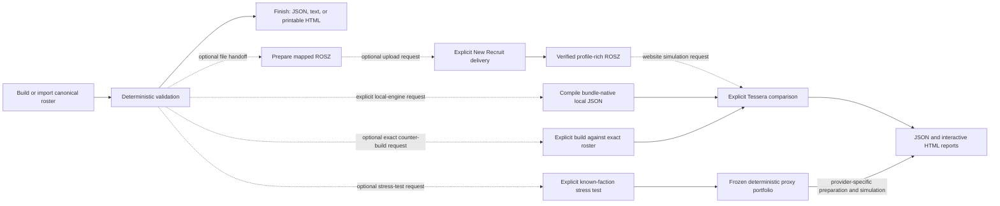
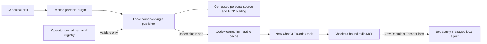
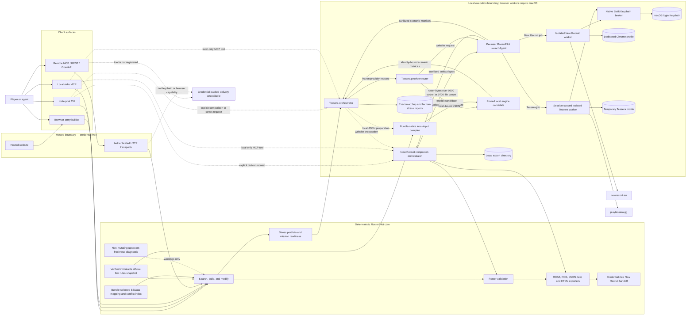
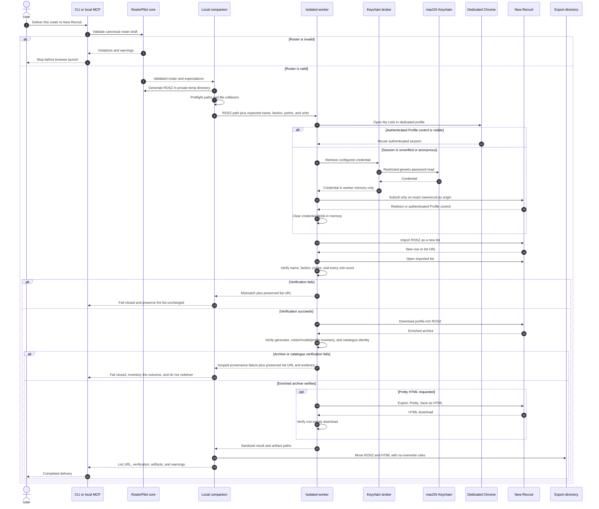
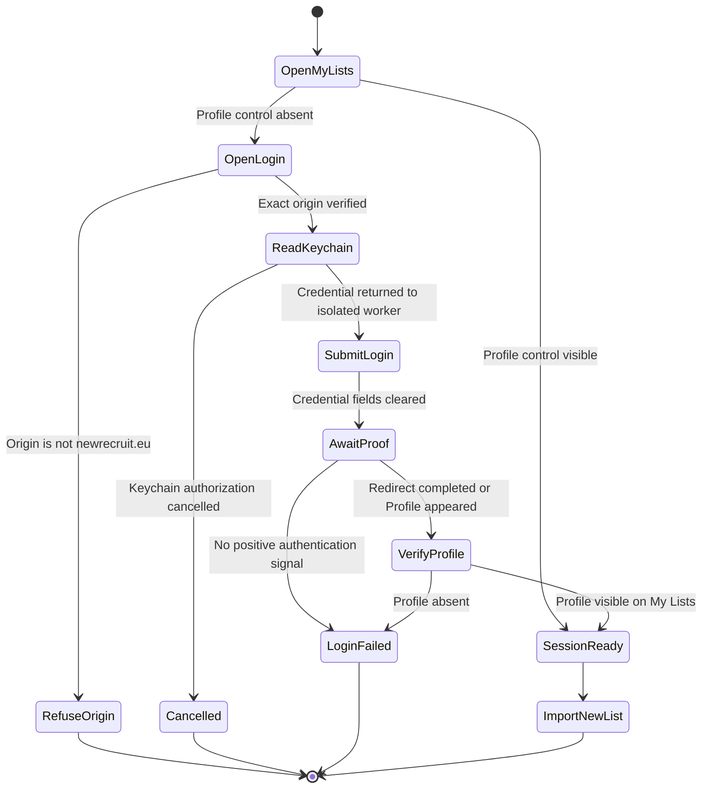
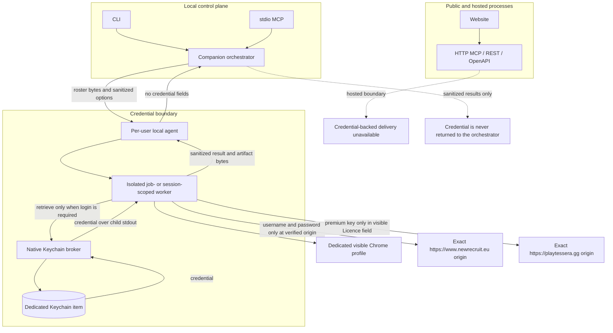

# RosterPilot architecture

RosterPilot is a deterministic Warhammer 40,000 roster engine exposed through
web, CLI, MCP, and REST surfaces. The roster engine and the immutable,
verified data-bundle snapshot leased by each operation remain the source of
truth. New Recruit is an optional local delivery and Pretty HTML backend, not
the canonical validator. The task-oriented entry points and commands are
documented in the [workflow guide](workflows.md).

## Capability model

Roster construction and New Recruit interoperability are deliberately separate
capabilities:

| Capability | Coverage | Authority |
| --- | --- | --- |
| Search, build, modify, validate, explain | All 35 embedded faction entries | Official-first reconciled rules: machine-verifiable Games Workshop publications over structured `40kdc-data` content |
| Printable HTML, text, roster JSON, New Recruit-shaped JSON | Every validated roster | RosterPilot serializers |
| `.ros/.rosz` import | Any roster whose selected BSData configuration, units, models, and wargear are mapped without a blocking conflict | Generated, versioned catalogue references |
| New Recruit import, enriched `.rosz`, and Pretty HTML automation | Same per-roster gate as `.rosz` | Local macOS companion |
| Tessera handoff and simulated matchup matrix | Website: verified New Recruit-enriched rosters. Local engine: bundle-native, hash-bound JSON compiled from canonical rosters within the evaluation adapter's declared profile capability | Provider router over the retained isolated website adapter and an explicit evaluation-only pinned local engine; `experimental` is only a deprecated CLI alias for strict `executionMode: "simulate"` |
| Known-faction stress testing | A validated player roster plus deterministic legal, New Recruit-exportable faction proxies within points tolerance | Shared portfolio and mission-readiness core, provider-specific preparation, and the selected Tessera provider |
| Exact-aware roster construction | A validated canonical opponent roster plus player build constraints and optional owned-model quantities | Shared roster engine, exact opponent threat profile, deterministic repair, and exact Tessera adapter |
| Durable Tessera jobs | Exact, stress, build-and-stress, and build-and-analyze requests on local CLI or stdio MCP | Persistent job document, local-agent-owned detached worker, retained result bundle, and stress manifest where applicable |
| Unified roster workflow | Fail-closed intent and faction resolution, deterministic build/validation, calibrated coaching, artifact-safe handoff, and explicit delivery authority | Shared `lib/rosterpilot/` orchestration under one transport-owned data-bundle lease |
| Approval-gated optimization | Frozen exact/faction baseline or six-archetype exact-report set, at most three candidate revisions, paired evidence, Pareto ranking, and exact winner or baseline-retention approval | Single-baseline and general-six optimizer coordinators plus existing durable Tessera exact/stress and paired-revision jobs |

### Workflow composition

Capabilities compose, but user workflows never continue implicitly. A legal
canonical roster can be the final result, an input to a file export, an input
to an explicitly requested New Recruit delivery, the player side of an exact
Tessera comparison, the player side of a known-faction stress test, or the
opponent-aware input to an explicitly requested counter-build.

The dotted edges are explicit choices, not automatic transitions. The Tessera
website provider depends on New Recruit enrichment. The local-engine provider
instead compiles canonical rosters and generated proxies directly from the
operation's immutable RosterPilot data bundle. Creating or exporting a roster
does not trigger either path. Exact comparison and faction stress testing are
also separate explicit choices. Counter-building uses the supplied canonical
opponent rather than silently reducing it to a faction heuristic. Comparison
suggestions never mutate a canonical roster.

The unified workflow composes those dotted edges only when the same request
names the action. A New Recruit capability question is not delivery authority.
An optimize request authorizes preparation and analysis, but candidate and
winner approvals are separate durable transitions; it never converts a
suggestion into a roster mutation by itself.

Space Marine chapter entries inherit the parent Adeptus Astartes unit pool while
retaining their chapter detachments, faction exclusions, and validation
context. Missing or ambiguous data fails closed for New Recruit exports;
generic building never implies that every possible selection in that faction
is mapped.

### Semantic data and New Recruit compatibility

[New Recruit](https://www.newrecruit.eu/) states that it consumes community
catalogues from the [BSData GitHub organization](https://github.com/BSData).
RosterPilot therefore consumes the public
[`BSData/wh40k-11e`](https://github.com/BSData/wh40k-11e) repository at an
exact commit. It does not scrape the New Recruit UI or call private APIs.

Runtime data is distributed in signed, content-addressed bundles. A manifest
records exact official, 40kdc-data, and BSData provenance separately from
global, faction, entity, mapping, portfolio, and conflict semantic hashes.
Global and dependency-aware faction shards allow one affected scope to advance
without invalidating unrelated rosters. `data/sources.json` and the generated
overlay describe the compiled application-release snapshot. The release gate
derives and verifies the separately signed offline bootstrap from that
snapshot; routine updates do not rewrite the tracked source files.
`scripts/sync-bsdata.ts` remains the deterministic candidate/bootstrap
extractor.

The authority order is scoped, not global. Machine-verifiable Games Workshop
downloads are authoritative for published points, leader links, Detachment
Points, Force Dispositions, errata, dataslates, and current Legends
classification. Legends classification comes from exact faction-pack
artifacts, not from the points manual or a BSData label. 40kdc-data remains the
structured operational source for units, weapons, stats, loadouts, and
community-authored mechanics. BSData is the New Recruit interoperability
source for catalogue IDs, selection paths, constraints, and export structure.
An unresolved official/community disagreement is quarantined at entity or
faction scope; RosterPilot never silently chooses a community interpretation.
Official overrides cross a separate publication trust boundary: the publisher
must hash the actual Games Workshop source artifacts and verify a one-to-one
inventory receipt signed by an independently reviewed extractor key. Runtime
overlay application is intentionally reusable, but it cannot by itself
authorize a signed bundle or application bootstrap.
The signed global shard carries the resulting authority state. Status tools
and roster provenance expose it on every transport; builds made from an
unavailable or legacy-unverified state remain usable but carry an explicit
warning. A verified-to-unavailable transition changes global semantic identity
and is quarantined before activation, while rotation between verified evidence
receipts does not invalidate roster or certification semantics.
The signed global shard retains the exact normalized official overlay alongside
its receipt-bound authority hashes. On a routine refresh, an unchanged official
version/content hash lets the publisher recover that evidence from the prior
verified snapshot. When 40kdc provenance is unchanged, the exact effective
rules and reconciliation are carried forward. When 40kdc changes, the retained
overlay is reapplied to the new structured entities, every reference and
official value is revalidated, and conflicts are recomputed. Missing or
mismatched entities fail closed. A Games Workshop source change still requires
new reviewed extraction evidence; a legacy bundle that did not retain the
overlay also cannot authorize reapplication to changed structured data.

An official Legends datasheet whose full structured unit is unavailable is
retained as an inventory-only record. It remains discoverable, but cannot be
built, validated, exported as a playable unit, or synthesized from BSData.
The update and roster-policy workflow is documented in
[Legends classification and roster policy](legends.md).

Roster export decomposes each validated unit-wide equipment bag with the same
exact model-composition solver used by `40kdc-data` legality checks. The shared
New Recruit resolver then maps each leader, regular model, specialist, and
loadout variant to one BSData model entry. Catalogue generation runs every
deterministic base loadout through that resolver and separately indexes legal
equipment absent from BSData, so preflight and runtime export cannot disagree
about a selection they both claim to support.

The reconciled rules engine remains authoritative for construction and
validation. BSData is authoritative for New Recruit identifiers and is a
cross-check for points and loadouts. A disagreement becomes a structured
conflict:

- roster validation warns about conflicts affecting selected units;
- `.ros/.rosz` and automated delivery block when a selected reference is
  missing, ambiguous, or conflicting;
- printable and canonical JSON exports remain available for a legal roster;
- unresolved mappings are never guessed.

Schema-v2 conflicts include a stable `rootCauseKey`, exact selection scope,
catalogue revision/path evidence, and a remediation owner. `source: "bsdata"`
means the pinned catalogue selection is absent, ambiguous, or differs from the
authoritative rules value; it does not claim the upstream project is at fault.
`source: "reconciler"` means RosterPilot cannot yet evaluate the catalogue
structure safely. Reports show both raw occurrences and unique root causes so
shared Space Marine data does not inflate the engineering backlog.

Each schema-v3 roster stores its exact `bundleId`, raw source provenance,
engine-data schema, `rosterRulesHash`, `factionRulesHash`, selected
`mappingHash`, and referenced entity hashes. V1 and V2 roster JSON remains
readable. When its relevant semantic content is unchanged, `rebase_roster`
returns a provenance-updated `compatible-rebased` roster. When rules or
mappings used by the roster changed, it returns `review-required` with exact
changed scopes and never changes selections automatically.

### Tessera boundary

Tessera is not a rules authority or roster validator. RosterPilot validates
canonical rosters before provider preparation. Simulation is selected only
through the local CLI or stdio MCP provider router. The providers have
separate, explicit input contracts:

- the website provider imports a mapped ROSZ into New Recruit, downloads and
  verifies New Recruit's profile-rich `.rosz`, and uses that enriched archive
  as its stable handoff;
- the local provider compiles a canonical roster directly from unit, weapon,
  composition, ability, and keyword data in the operation's immutable bundle
  into `rosterpilot-local-engine-input` JSON. It does not upload to New
  Recruit, open either website, use a browser profile, or retrieve a
  credential.

Neither provider changes roster legality or the operation's immutable
data-bundle lease. An exact opponent supplied only as an enriched `.rosz` can
still use the legacy archive compiler, but canonical player, opponent, and
generated-proxy rosters use bundle-native JSON when `local-engine` is selected.

The website adapter does not call private APIs or read browser storage. The
orchestrator never handles premium keys: only its isolated Tessera worker may
retrieve the dedicated Keychain item. The key stays only in that worker's
memory, and the worker enters it only after verifying the exact Tessera origin
and locating its visible Licence key field. Before website browser or
licence-key work, both the per-user agent and the isolated worker reopen the
player and opponent archives. Every website archive must identify New Recruit
as its generator, contain units and embedded profiles, and give every
top-level unit at least one Unit profile and one Melee or Ranged weapon
profile. This is a profile-readiness boundary, not a claim that embedded
characteristic values equal another rules source.

Local preparation is content-addressed and bound to the roster execution
fingerprint, exact `bundleId`, compiler version, and optional profile-policy
hash. A durable worker activates the job's archived bundle before preparation;
the compiler rejects a roster whose source bundle is not that active snapshot.
Preflight, execution, resume, and restart reparse the JSON and verify its
schema, SHA-256, bundle identity, compiler version, and frozen roster identity.
Missing profiles, unsupported characteristics, unresolved alternate profiles,
or any identity mismatch fail closed. Refresh and rollback can affect future
leases but cannot change an input already frozen for a durable run.

The current local compiler is explicitly
`base-profile-evaluation-v1`. It models unit and weapon profiles plus supported
intrinsic weapon keywords. It does not apply army or detachment rules,
datasheet abilities, enhancements, non-weapon wargear effects, stratagems, or
attached-unit interactions, and it does not model range or distance-dependent
effects such as Conversion. Its hashed input records those unmodeled systems,
omitted abilities and wargear, unsupported weapon keywords, and every frozen
alternate-profile, firing-set, melee-set, or mixed-defence decision.
Preparation and simulation surface those records as warnings. The evidence
remains evaluation-only and cannot silently become full-rules evidence,
substantive coaching, or an optimizer decision.

Persisted prepared-roster schemas retain the legacy field names
`sourceRoszPath`, `enrichedRoszPath`, and their SHA-256 fields so older reports
and manifests remain readable. For
`simulationInput.kind: "rosterpilot-local-engine-input"`, those paths refer to
the canonical source JSON and compiled local-input JSON, not ZIP archives; the
discriminator, content hashes, and `.json` filenames are authoritative. Stress
artifact inventories label them `player-source-json`,
`player-local-engine-input`, `opponent-source-json`, and
`opponent-local-engine-input`; new consumers must not infer the artifact format
from the legacy property name.

#### Simulation-provider selection and promotion

The request freezes `simulationBackend` as `auto`, `website`, or
`local-engine`, and reports record both the requested and selected provider
with its exact identity.

- `website` selects only the existing browser adapter.
- `local-engine` selects only the local adapter. Canonical inputs take the
  bundle-native JSON route, and preparation reports zero remote mutations and
  zero New Recruit cache reuses. Compilation or verification failures do not
  fall back to New Recruit or the website.
- `auto` selects the local adapter only when that exact identity is marked
  promoted, available, and preflight-complete. Otherwise it selects the
  website and records why. If a promoted local execution starts and then
  fails, the router discards all local evidence before one complete website
  rerun and records an atomic fallback receipt.

The reviewed dependency is a development-only GitHub codeload archive pinned
by commit, tree, SHA-256, lockfile integrity, package entry point, and licence
metadata. `scripts/verify-tessera-engine-provenance.mjs` checks those fields and
a fixed-seed public-API smoke result. The tracked provider identity remains
`candidate` and `evaluation-only`; no runtime path can infer promotion merely
from package availability.

Promotion requires an explicit written-licence decision and complete parity
evidence for identical normalized inputs, profile policy, data bundle, and
scenario contract. The parity comparator checks every cell with
metric-specific Monte Carlo tolerances, requires at least 98% within tolerance
for each metric, rejects any cell beyond twice its tolerance, and compares
winner classifications outside uncertainty boundaries. Unit tests exercise
this policy but are not live promotion evidence. Until promotion, `auto`
continues to use the website and local-engine evidence is ineligible for
substantive coaching, roster-change candidates, or optimizer decisions.

Opponent scope selects one of three non-overlapping routes:

- exact comparison accepts one canonical opponent roster or one `.rosz`;
- known-faction stress freezes deterministic legal proxies for an unknown
  exact list;
- exact-aware construction derives a versioned threat profile from one
  validated canonical opponent's selected model counts, points, tags, and
  vehicle/monster keywords, fingerprints its complete payload, builds and
  repairs the player roster, then invokes exact comparison.

The exact route does not accept faction archetypes. A CLI request that supplies
only `--opponent-faction` to exact analysis fails with
`OPPONENT_SCOPE_REQUIRED` and directs the caller to stress testing. No route
guesses a faction when both exact and faction scope are absent.

Exact-aware construction defaults to a collection profile of
`{ "mode": "open-catalog" }`, which leaves the full eligible build-supported
player catalogue available under the ordinary build constraints and is labeled
as such in the result. An `owned` profile is a closed allow-list of unit IDs
with optional `maxUnits` and aggregate `maxModels` limits. Units omitted from
it are unavailable. The readiness gate requires 98% points utilization and a
non-red overall mission-readiness band unless the caller explicitly accepts
the warning. Candidate revisions remain authorization-gated suggestions.

An exact-list full analysis captures 16 raw scenarios per opponent: two phases,
four metrics, and both directions. Quick mode captures Shooting wipe
probability in both directions. Both providers record settings and iteration
counts, map repeated unit names to stable roster instances, and consolidate
metric matrices into phase/direction scenarios. Local results additionally
bind deterministic seed, execution, and projection hashes. The website adapter
confirms each visible phase and metric selection, and fingerprints each raw
table from its headers, dimensions, and values for provenance. A website
control transition is accepted only after the requested exclusive state is
visible, the table node is replaced or its matrix subtree mutates, and the
resulting table is stable for three reads. The numeric fingerprint may remain
equal across controls or distinct proxy payloads; equality alone is not
evidence of stale UI. A control transition without a matrix refresh is stale
and remains available only as diagnostic evidence. Duplicate simulation
payloads are rejected separately before provider execution.

A known-faction stress test freezes a deterministic proxy portfolio before any
provider execution. `core-3` is posture-first: it requires distinct
balanced-control, ranged-pressure, and assault-pressure proxies. Their
composition labels describe the generated rosters and help maximize feasible
diversity, but repeated labels do not reduce core coverage. `diverse-9` crosses
those three postures with the stable `mixed`, `mass`, and `elite-heavy` wire
labels. These are faction- and posture-relative threat lenses bound to the
portfolio methodology hash rather than universal composition quotas. The v6
generator measures model
density, points per model, Infantry and Vehicle/Monster share, selected-weapon
ranged/melee pressure, mobility, role breadth, and largest-unit concentration.
Each portfolio hashes the observed faction/posture ranges and records whether
they are generated-pending-review or human-reviewed against the exact faction
and portfolio semantic hashes; horde-tag share is context, not a gate. Proxies must be legal, New
Recruit-exportable, within the same 5%
points tolerance, and distinct by a simulation-payload fingerprint over units,
models, equipment, enhancements, and only modeled rules. Detachment-only
differences do not count. `core-3` requires three unique simulation
fingerprints and all three postures. Available proxies have equal analytical
weight; they are coverage cases, not an empirical distribution of tournament
lists.

The portfolio preview surface runs this construction and exportability
preflight locally and exposes fingerprints, composition evidence, coverage
cells, named-anchor status, and profile requirements without invoking New
Recruit or Tessera.

The explicit full-loop adapter first builds with structured opponent context
and mixed-threat intent, runs a bounded deterministic repair, then stops unless
the roster uses at least 98% of its points and has no red overall mission
readiness result. The escape hatch is explicit. It assigns a stable descriptive
name and never applies post-simulation changes.

Stress preflight validates the player, locally verifies `.rosz` exportability
for all available proxies, reserves report and manifest paths, and scans known
multi-profile equipment before starting an external action. The exportability
gate remains part of the frozen portfolio contract even when the local provider
will simulate bundle-native JSON; it performs no upload. Unresolved choices
produce a policy scaffold and `TESSERA_PROFILE_POLICY_REQUIRED`. A
`ProfilePolicyV1` entry binds faction, unit, weapon group, phase, selected
profile, and active count, and its canonical SHA-256 is frozen into the
execution fingerprint, manifest, report provenance, and paired revision.

Website preparation checks enriched archives against the complete inventory
and persists an enrichment-only decision before simulation. Local preparation
checks the same frozen requirements against bundle-native profiles and embeds
them in each compiled JSON input. A completed replacement policy may be adopted
only while the manifest has zero Tessera attempts, so resume can reuse the
verified provider-specific artifacts without weakening paired provenance.

The default `diverse-9` staged strategy screens every available proxy with
half-wipe probability for both phases and directions. It waits until every
required screen is complete, confident, and integrity-clean before selecting
and freezing the stress, central, and contrast representatives for the other
three metrics. Deep dives therefore never race a changing screening set. A
complete `diverse-9` staged run captures 72 raw scenarios. `core-3` defaults to
`full-all`: every ready proxy is necessarily a representative, so one full
provider pass per proxy preserves the same required 48-scenario evidence while
avoiding a redundant second provider setup pass. An explicitly requested
staged core run remains supported for recovery testing. `full-all` applies all
four metrics to every proxy, producing 144 raw scenarios for a complete diverse
suite.
Tessera simulation requires `executionMode: "simulate"`; prepare-only returns
verified handoffs with `status: prepared` and no inferred cells. The legacy
`experimental` option is a deprecated compatibility alias.

Stress report schema v3 and manifest schema v5 record the player fingerprint,
`bundleId`, scoped semantic roster identities, profile-policy hash, opponent
faction, the complete frozen portfolio and its canonical SHA-256, requested
and selected simulation backend, configuration,
prepared-artifact hashes, representative selection, and every stage's status,
attempt count and history, timestamps, structured error, retryability, next
action, report path, and content hash. Resume revalidates identity, requested
cells, provider selection, exact profile policy, and hashes. V1 through V4
manifests are migrated in memory and rewritten as v5 on resume. V1 paired
baselines without exact profile
provenance are rejected. Transient entries receive at most three automatic
attempts with one- and three-second backoff and five lifetime attempts through
explicit resume; terminal errors require an explicit forced retry within that
same ceiling.

Before any website-provider New Recruit delivery, the manifest persists an
in-progress marker.
The verified receipt and enriched-file hash replace it after delivery. If the
process stops in that narrow interval, resume reports an unknown external
outcome and fails closed instead of risking a duplicate list. Resume also
rejects a changed fingerprint, `bundleId`, semantic roster identity, faction,
suite, strategy, or
simulation setting. This prevents a resumed result from silently mixing
incomparable runs.

A created mutation receipt first copies the verified source/enriched pair into
a content-addressed, support-owned recovery directory, then seals its absolute
paths and both content hashes before the outcome is finalized. Resume rehashes
and revalidates those regular, non-symlink files when the ordinary cache is
unavailable, so a provisional-cache write failure or moved run output cannot
strand a verified remote mutation or trigger another delivery. The same
contract covers canonical rosters and content-addressed uploaded opponent ROSZ
subjects. Releases from before this receipt field can be repaired only from an
explicitly supplied durable Tessera job whose run ID, directory, roster
identity, and ROSZ hashes all match; the repair writes local recovery state and
performs no browser or network activity. Missing, changed, ambiguous, or
incompatible evidence remains fail-closed.

Canonical New Recruit delivery always obtains the enriched archive and compares
its observed game-system and faction-catalogue identity with the roster's
snapshot. Catalogue drift remains fail-closed by default. An explicit
diagnostic may accept only a forward game-system-revision mismatch when all
identity fields are present and the exact faction catalogue still matches. A
qualifying post-mutation artifact is retained in a separate provisional
namespace so a new diagnostic run can recover it without repeating the
non-idempotent New Recruit mutation. Other drift, missing identity, and
incomplete profiles remain blocked. Construction and unrelated factions remain
available, and every remote outcome is inventoried.

`resumeManifestPath` (CLI `--resume`) continues the same run ID and attempt
history. Once its five-attempt budget is exhausted, `restartManifestPath` (CLI
`--restart-from`) requires a different output directory and creates a new
manifest, run ID, and empty simulation stages. A restart carries forward the
frozen portfolio, policy, and only those provider-specific prepared artifacts
whose discriminator, identities, and hashes still verify; the source manifest
is never rewritten. Resume and restart are mutually exclusive.

For client calls that cannot remain open, the local durable-job layer writes a
`tessera-run.json` document before asking the current local agent to launch a
detached worker. It supports exact, stress, build-and-stress,
build-and-analyze, exact paired revision, and stress paired revision requests
and exposes
queued, running, needs-input, complete, degraded, inconclusive, failed, and
cancelled states. Status can include the retained result. Profile resolution
is allowed only while stopped, freezes a validated policy in the job bundle,
and requires a subsequent resume. An external stress manifest from v1, v2, or
v3 is copied into the run bundle, verified, and migrated to portable v3 before
it is adopted; subsequent recovery uses only the shared durable job. Recovery
does not widen the frozen request. In particular, `catalogueDriftMode` is part
of the request hash; resume and restart inherit it and cannot enable or change
the diagnostic choice. Exact jobs
freeze and reverify prepared player and opponent artifacts for zero-redelivery
resume. Those are source/enriched ROSZ pairs for the website provider and
source/local-input JSON pairs for canonical local-engine inputs;
`restart-from` copies the verified pair into the new run but starts simulation
evidence from a clean stage.
Exact simulation remains one analytical stage rather than claiming the stress
workflow's per-opponent screening/deep-dive checkpoints. The job manifest
freezes request, `bundleId`, scoped semantic identities, policy, runtime,
artifact, and per-attempt provenance.
Runtime evidence records the observed macOS, Node, Chrome/Playwright and broker
versions, the required local-agent protocol/version, the actual status
response and observed launchd process identity, MCP source build identity, and
frozen bundle/source freshness
timestamps; unavailable observations remain `null`. Its
first three attempts are automatically scheduled for retryable failures by
the outer job coordinator. Stress stages make at most one attempt per outer
attempt, so attempts four and five require explicit resume. Five is the
lifetime ceiling.
Explicit restart-from opens a new run and simulation stage using only
hash-verified frozen inputs; it never carries prior simulation evidence.
Cancellation stops the local-agent-owned worker
without deleting job state, artifacts, inventory entries, or remote New
Recruit lists.

Matchups at or below a 5% difference relative to the player's points limit are
classified as matched. Exact opponents outside that inclusive tolerance fail
closed unless `allowPointMismatch` is explicit; an overridden report is
classified as unmatched and cannot produce roster-change candidates.
Out-of-tolerance generated faction proxies are omitted.

Schema-v3 exact reports retain provider-recorded settings, import warnings, structured
findings with cell-level evidence, and up to three validated single-operation
change candidates for matched comparisons. Candidate qualification requires a
legal and New Recruit-exportable result, at least 98% points utilization, no
mission-readiness regression, and evidence tied to the affected player unit or
a role gap. A unit classified as a reliable or portfolio-wide robust answer is
not offered as a replacement; testing such an alternative requires a
separately authorized paired revision. An empty candidate set is preferred to
an underfilled roster. Candidates never mutate a roster. Import issues carry
side, unit, weapon group, phase, and profile choices; only the affected
attacking unit's cells are ambiguous.
After explicit approval, `compare_roster_revision` validates a same-faction
revision, freezes and verifies the baseline opponent artifacts, source
identities, points contract, profile policy, scenarios, iterations, settings,
selected backend, and provider identity, and records improved, worsened, unchanged, or
ambiguous cell deltas. Its roster-level conclusion uses trusted aggregates and
is `improved` only when at least one applicable aggregate materially improves
and none worsen; otherwise it is `worsened`, `mixed`, or `unchanged`.
Materiality is five percentage points for wipe probabilities, the greater of
0.5 model or 10% for mean kills, and the greater of one wound or 10% for mean
damage. Incomplete trusted aggregate coverage remains ambiguous.

Faction stress reports are schema v3. `prepared` means external preparation
completed without a simulation request. `failed` means requested simulation
did not produce trusted evidence. `inconclusive` means some evidence exists
but confidence or integrity is insufficient. `degraded` permits at least six
execution-distinct exportable proxies across all three postures only when every
other requested composition cell has a reviewed-not-applicable exception bound
to the exact faction and portfolio semantic hashes; only all nine cells can be
`complete`.
Missing estimates are `null`, while below-threshold
observations live in a separate `provisional` structure with explicit point
coverage. Reports summarize directional combat robustness, never whole-game
win probability. Mission readiness remains separate.

After explicit approval, `compare_stress_test_revision` requires the same
player faction, points limit, `bundleId`, and relevant semantic roster hashes.
It reuses the exact baseline prepared proxy files, portfolio, analysis
strategy, simulator configuration, and representative selections; it never
regenerates or reselects the opposing suite. Before revised-player preparation
it verifies every proxy's artifact kind, execution fingerprint, and SHA-256
content hash. After the rerun it
actively reapplies and then requires identical recorded settings and iteration
counts for each exact phase/metric/direction scenario, not merely matching
stage-level totals. Margin changes smaller than one percentage point are
classified as unchanged. The
paired conclusion uses the screening half-wipe robustness deltas; deep-dive
wipe, kill, and damage results remain supporting evidence. The conclusion is
suppressed if the mission-readiness guardrail detects a regression.

If the selected provider is unavailable or an individual simulation fails,
verified provider inputs remain usable: enriched ROSZ for the website or
bundle-native JSON for the local engine. A new exact report is `failed` when no
trusted matrices exist and `inconclusive` when captured evidence cannot support
analytical confidence; stress reports use the same distinction. Missing
scenarios and warnings stay visible. Reports describe modeled damage efficiency
and unit threats, never a whole-game win probability. Hosted MCP, REST,
OpenAPI, and the public website do not register exact-matchup or stress-test
browser tools. Faction stress testing is available only through the terminal
CLI and local stdio MCP; there is no public stress-test UI.

Verified New Recruit artifacts are stored in a local content-addressed cache
keyed by roster execution/export compatibility identities. Reuse requires the
relevant semantic hashes, file hash, and exact enriched summary to match; raw
provenance movement alone does not invalidate an otherwise compatible entry.
Trusted and provisional artifacts are separate. A provisional receipt is
integrity-sealed and binds export and execution fingerprints, frozen source
data, source and enriched hashes, the enriched summary, observed catalogue
comparison, per-unit profile-coverage hash, and connector evidence. Every
lookup recomputes those values. A provisional entry is never returned through
the trusted-cache loader and is accepted downstream only when the current
identity matches or the frozen request explicitly allows the narrow
forward-revision diagnostic.
Remote list URLs are retained in a local run inventory and are never deleted
automatically. A website-backed stress run also reuses one isolated,
session-scoped Tessera worker across its proxy requests.
That worker owns one live browser context and keeps the premium key only in
memory. Explicit session close or seven days of inactivity removes its
user-only browser profile. Local-agent shutdown closes the worker and context
but retains that `0700` run profile so a verified resume can select exact
existing Tessera lists after restart. Transient browser, session, or navigation
failures reset the context without deleting the profile before a later attempt.
Premium unlock retains the key through a bounded positive-state poll, and
absence, rejection, timeout, still-locked UI, missing/stale matrix, and
incomplete scenario failures have distinct codes.

The local manifest is the recovery record and may contain absolute paths.
Shareable JSON and HTML use relative artifact references so the output bundle
can be relocated. Remote New Recruit list URLs remain only in the local
manifest/inventory and are removed from shareable reports. Terminal progress
is emitted on stderr; stdout is a compact
summary with status explanation, portfolio and integrity state, recovery
state, representatives, and the full report path. The complete nested result
is opt-in through `--full-json`.

### Freshness policy

Reproducibility and freshness are separate checks. Every data-consuming
request leases one immutable verified bundle; a live source check or atomic activation never
changes points in the middle of a build.

- The shared provider checks the signed stable channel at startup. Long-lived
  runtimes schedule a 15-minute background check; request-driven runtimes also
  check when the interval has elapsed on the next data operation. Stable-channel
  refresh never blocks a build after bootstrap initialization. A verified
  candidate is downloaded and classified before the active pointer moves
  atomically, and activation affects only future leases.
- `get_data_status` reports engine and roster provenance.
  `get_data_update_status` distinguishes the bundle currently in use, the
  latest verified bundle, the latest upstream candidate, its semantic
  classification, and quarantined scopes. `refresh_data_now` performs an
  immediate signed-channel check; `rollback_data_bundle` selects an exact
  archived verified bundle for future leases.
- Update-status, refresh, and rollback are control-plane operations. They intentionally
  do not acquire a roster-data lease; activation waits for existing
  data-consuming leases before moving the active pointer.
- Durable jobs freeze an exact `bundleId` and load that archived bundle when
  resumed. A runtime activation or rollback cannot mix new data into their
  evidence. Moving to current data requires a new run or a compatible roster
  rebase.
- Doctor runs local prerequisites, agent/browser status, committed-data
  validation, and engine status independently. With `--refresh skip` it makes
  no network-backed source check. With `--refresh check`, pinned-source
  synchronization and live freshness are separate warning-class results, so
  an offline source cannot hide a local readiness failure.
- `check_data_freshness` and the Doctor source checks compare raw upstream
  Games Workshop, 40kdc-data, and BSData provenance as diagnostics. They do
  not activate unverified data.
- CLI, MCP, REST, the local agent, workers, and the browser-facing engine use
  the same active provider snapshot rather than importing their own
  process-global dataset.
- A daily GitHub workflow stages candidate data outside the checkout, computes
  semantic deltas, skips certification churn for provenance-only updates, and
  certifies only affected scopes otherwise. It publishes immutable bundle
  objects and moves the independently signed stable pointer last on the
  `data-bundles` branch. Signed pointers form a monotonic, content-addressed
  predecessor chain. Local and hosted providers retain the accepted cursor
  with compare-and-set storage, reject replayed revisions after restart, and
  represent canary rollback as a newer explicitly signed transition rather
  than rewinding channel history. Automated canary rollback derives its target
  only from that verified signed-v2 ancestry; the mutable update report is
  informational and cannot redirect it. Repeated freshness observations with
  no source-identity change reuse the current bundle and do not grow pointer
  ancestry, while a new upstream commit is still recorded even when classified
  `provenance-only`. An ambiguous or regressive candidate is quarantined;
  the current verified pointer remains unchanged. See
  [`data-bundles.md`](data-bundles.md).

## ChatGPT/Codex local integration boundary

The canonical workflow source is `skills/rosterpilot/`.
`plugins/rosterpilot/` is its source-synchronized, portable package and never
contains a machine-specific MCP path. On the owner Mac,
`plugin:local:install` materializes `~/plugins/rosterpilot`, assigns a unique
build-metadata version, and adds a generated `.mcp.json` bound to the current
Node executable and checkout. The operator-owned `personal` marketplace must
already map `rosterpilot` to `./plugins/rosterpilot`; RosterPilot validates
that registry but does not edit it.

Codex creates and owns the immutable
`$CODEX_HOME/plugins/cache/personal/rosterpilot/<version>` copy and the active
MCP registration. RosterPilot invokes the Codex plugin lifecycle, then verifies
the installed record and the effective stdio transport; it never patches a
cache version in place. The marker-protected standalone skill at
`$CODEX_HOME/skills/rosterpilot` is synchronized in the same publication
transaction. Existing unmanaged skill and personal-source directories are
never adopted without exact identity checks.

A project-local `[mcp_servers.rosterpilot]` configuration is an alternative
delivery path and takes precedence over the plugin-owned server. Setup skips
creating it when `rosterpilot@personal` is already registered, while the plugin
installer refuses to publish if a shadowing entry exists. A successful plugin
reinstall affects new ChatGPT/Codex tasks only: an existing task retains the
skill and MCP tool snapshot captured when it began.

Personal-plugin publication owns only Codex integration. It neither installs
nor restarts the per-user LaunchAgent. Browser-backed New Recruit and Tessera
website work require their setup profiles, and durable jobs still require the
current local agent. The pinned local engine itself uses no browser or
credential. Checkout, build, or runtime drift is repaired separately with
`rosterpilot agent ensure-current`.

## System architecture

The hosted website and HTTP transports never receive New Recruit credentials
and cannot invoke the local browser worker. Terminal CLI and local stdio MCP
send high-level jobs to the per-user agent. Sandboxed clients fall back to an
atomic, per-user file queue under `/private/tmp`; neither transport has a
credential-retrieval operation.

## Roster delivery workflow

Automated delivery is a non-idempotent external action. It runs only after an
explicit request to upload, import, or send a roster to New Recruit.

## Authentication state machine

RosterPilot proves authentication positively. The absence of a login form is
not enough because New Recruit supports anonymous local lists. A session is
reusable only when the authenticated `Profile` control is visible.

## Trust boundaries and secret flow

Security invariants:

- Credentials are collected only by the native secure dialog.
- Credentials never appear in CLI arguments, environment variables, MCP
  payloads, logs, screenshots, diagnostics, or exported files.
- Only an isolated worker invokes the broker's credential retrieval command.
  New Recruit workers are job-scoped; Tessera workers are session-scoped and
  discard the in-memory key when the session closes or expires.
- The local-agent protocol accepts roster jobs and status checks, never a raw
  credential retrieval request.
- The New Recruit worker enters credentials only after exact-origin
  verification. The Tessera worker similarly enters the premium key only into
  Tessera's visible Licence key field on the exact Tessera origin.
- The automation does not inspect cookies or browser storage and does not call
  private New Recruit APIs.
- Login pages are never captured in screenshots.
- Hosted transports do not expose credential-backed delivery tools.

## Component map

| Component | Responsibility | Primary source |
| --- | --- | --- |
| Roster engine | Search, build, modify, validate, explain, export | `lib/rosterpilot/` |
| Data-bundle provider | Verify signed channel and payloads, lease immutable snapshots, activate atomically, archive, quarantine, retain, and roll back | `lib/rosterpilot/runtime-data-bundle.ts`, `lib/rosterpilot/remote-data-bundle-provider.ts`, `lib/rosterpilot/hosted-data-bundle-provider.ts`, `local/data-bundles/` |
| Catalogue generator | Pin and reconcile BSData identifiers, coverage, and conflicts | `scripts/sync-bsdata.ts` |
| Bundle release pipeline | Reconcile official evidence, build/sign immutable shards, verify bootstrap/trust assets, classify scoped deltas, certify, publish the stable pointer last, and quarantine failed candidates | `scripts/official-data-overlay.ts`, `scripts/prepare-data-bundle-release.ts`, `scripts/prepare-data-bundle-update.ts`, `.github/workflows/application-release.yml`, `.github/workflows/data-freshness.yml` |
| Freshness monitor | Compare raw upstream Games Workshop, 40kdc-data, and BSData provenance without changing the active bundle | `lib/rosterpilot/freshness.ts` |
| Stress-test core | Generate deterministic faction portfolios, structural fingerprints, and mission-readiness guardrails | `lib/rosterpilot/stress-portfolio.ts`, `lib/rosterpilot/mission-readiness.ts` |
| Local CLI | Terminal commands and local file operations | `cli/rosterpilot.ts` |
| MCP server | Shared roster tools plus conditionally registered local tools | `mcp/server.ts` |
| Local stdio MCP | Injects local file writers and macOS companion | `mcp/stdio.ts` |
| Per-user local agent | Cross-process queue, provider status, checkout identity, and secret-free roster job transport | `local/agent/server.ts` |
| Companion orchestrator | Validation, collisions, local-agent requests, and artifact publication | `local/new-recruit/companion.ts` |
| Browser adapter | Authentication, import, verification, Pretty export | `local/new-recruit/browser.ts` |
| Tessera orchestrator | Exact matchups, matched-points policy, scenario consolidation, findings, candidates, and exact-list revision deltas | `local/tessera/companion.ts` |
| Tessera provider router | Freeze explicit/automatic provider selection, enforce promotion and preflight gates, and make any automatic website fallback atomic | `local/tessera/simulation-provider.ts` |
| Local Tessera input compiler | Compile canonical rosters from the active immutable bundle into schema-, hash-, roster-, bundle-, compiler-, and policy-bound evaluation JSON without a remote mutation | `local/tessera/local-engine-input.ts`, `local/tessera/local-engine-preparation.ts` |
| Local Tessera evaluation adapter | Verify bundle-native JSON, retain the legacy enriched-ROSZ reader for compatible persisted inputs, invoke the pinned public engine contract, and emit deterministic scenario evidence plus limitation warnings | `local/tessera/local-engine.ts`, `local/tessera/tessera-engine-provenance.json` |
| Tessera provider parity | Compare identity-bound local and website evidence using completeness, metric tolerance, and winner-classification gates | `local/tessera/provider-parity.ts` |
| Exact-aware build loop | Validate an exact opponent, build and repair from its threat profile, enforce readiness, and invoke exact analysis | `local/tessera/exact-full-loop.ts`, `lib/rosterpilot/build-and-analyze.ts` |
| Faction stress orchestrator | Preflight, delivery reuse, staged execution, resume manifests, robustness aggregation, and frozen paired revisions | `local/tessera/stress.ts`, `local/tessera/stress-analysis.ts` |
| Durable Tessera jobs | Persist requests and results; ask the local agent to start workers; inspect, resume, resolve profiles, and cancel background runs | `local/tessera/jobs.ts`, `local/agent/server.ts` |
| Tessera optimizer coordinator | Freeze a verified baseline and active bundle identity; atomically persist candidate, comparison, Pareto, retention/winner approval, and finalization receipts; reject stale revisions and identity drift | `local/tessera/optimizer.ts`, `local/tessera/optimizer-store.ts` |
| General-six Tessera optimizer | Freeze one deterministic portfolio and six completed exact baselines; materialize each candidate once; bind six paired revisions by candidate, archetype, and request hash; enforce aggregate no-regression Pareto and separate approvals | `local/tessera/general-optimizer.ts`, `local/tessera/general-optimizer-store.ts` |
| Tessera website UI and reports | Visible website simulator control/extraction plus provider-aware exact-matchup and faction-stress HTML rendering | `local/tessera/browser.ts`, `local/tessera/report.ts`, `local/tessera/stress-report.ts` |
| Isolated workers | Hold credentials in memory and return sanitized results; New Recruit is job-scoped and Tessera is session-scoped | `local/new-recruit/worker.ts`, `local/tessera/worker.ts` |
| Keychain broker | Native secure configuration and restricted credential access | `native/NewRecruitKeychainBroker.swift` |
| Hosted API | Credential-free REST, browser-engine operations, and remote handoff under server snapshot leases | `app/api/v1/[...path]/route.ts`, `app/hosted-data-bundles.ts` |
| Browser UI | Device-local draft history with roster operations delegated to a same-origin, Fetch-Metadata-guarded, credential-free leased engine; headerless and cross-origin callers use the authenticated REST surface instead | `app/page.tsx`, `app/api/browser-engine/route.ts` |
| Canonical Codex workflow package | Keep the canonical skill and portable tracked plugin source-synchronized without machine-local paths | `skills/rosterpilot/`, `plugins/rosterpilot/`, `scripts/sync-rosterpilot-plugin.mjs` |
| Managed standalone Codex skill | Install and inspect only the marker-protected per-user skill copy | `scripts/manage-rosterpilot-skill.mjs` |
| Personal ChatGPT/Codex publication | Validate marketplace ownership, generate the machine source and MCP binding, request immutable-cache registration, probe startup, verify effective state, and roll back managed layers on failure | `scripts/manage-rosterpilot-personal-plugin.mjs` |
| Local MCP configuration renderer | Generate one checkout-bound Node, loader, server, working-directory, and public data environment contract for standalone and plugin MCP paths | `scripts/setup.mjs` |

## Installation and deployment boundaries

| Surface | Installation unit | Portability and durability rule |
| --- | --- | --- |
| Core engine, CLI, and stdio MCP | Complete Git checkout, locked Node dependencies, and compiled release data; signed bootstrap, trusted Ed25519 public keys, and a channel URL enable runtime updates | Supported on macOS, Linux, and Windows; without signed-update configuration it reports compiled fallback explicitly rather than claiming a verified signed bootstrap |
| Standalone local MCP configuration | Ignored project-local `.codex/config.toml` or a copied client configuration | Absolute Node and checkout paths are generated from the current machine; do not combine the `rosterpilot` entry with the personal plugin in one checkout |
| Personal ChatGPT/Codex plugin | Portable tracked package, generated per-user source, marker-protected standalone skill, and a Codex-created immutable cache version | Registry and cache are never edited directly; moving the checkout or Node requires `plugin:local:install` and a new task or app restart |
| Hosted website, REST, and HTTP MCP | Validated Cloudflare-compatible build, signed bootstrap bundle, trusted public keys, signed-channel URL, and persistent bundle storage | Uses only credential-free core capabilities and never imports local automation modules into a hosted tool contract |
| New Recruit and Tessera website automation | Per-user macOS LaunchAgent, installed broker, and one complete checkout | Setup records the exact checkout and Node executable; status verifies checkout, protocol, build provenance, and runtime freshness |
| Local Tessera evaluation | Complete Git checkout, locked Node dependencies, and the exact archived runtime data bundle | Uses the local CLI or stdio MCP, performs no browser, Keychain, New Recruit, or Tessera website operation, and remains evaluation-only until promotion gates pass |
| Roster and report artifacts | Caller-selected directory | Writes stay inside the current directory by default and never overwrite without explicit approval |

The LaunchAgent intentionally runs reviewed worker code from the checkout that
installed it, while the native broker is copied into per-user application
support. Moving the repository or changing the Node installation requires
rerunning the selected setup profile. Protocol and checkout identity checks
turn that condition into an actionable failure instead of allowing a newer CLI
to call stale background code. `agent ensure-current` also compares build
provenance and runtime staleness, then uses the existing restart or installation
lifecycle and returns both the original issues and the repair actions.

Runtime refresh is enabled only when the application has a schema-compatible
signed bootstrap, at least one pinned Ed25519 public verification key and key
ID, a signed stable-channel URL, and writable bundle storage. CI publication
additionally requires the matching private signing JWK, immutable bundle
hosting, and permission to move the stable pointer after certification. The
private key never ships to a client. Key rotation overlaps trusted key IDs.
The persistent local store retains the active bundle, the previous three,
every registered roster or durable-job reference, and unreferenced bundles for
at least 30 days. Hosted deployments must configure their archive adapter to
promise the same cold-start rollback and quarantine durability; an ephemeral
runtime reports that limitation and cannot advertise persistent rollback.

The repository CI verifies the locked install on macOS, Linux, and Windows and
runs lint, tests, a production build, rendered-output checks, and deterministic
catalogue regeneration before changes are considered ready.

## Failure behavior

The personal-plugin publisher also fails closed:

- an invalid `personal` marketplace mapping stops before publication;
- a project-local `mcp_servers.rosterpilot` shadow is reported and refused;
- unmanaged or identity-mismatched source and skill directories are not
  replaced;
- missing Node, loader, or MCP paths and failed MCP startup or baseline tool
  discovery block registration;
- `plugin:local:check` reports stale canonical packaging, managed skill,
  personal source, immutable cache, plugin record, or effective MCP transport
  without changing state;
- a failed publication restores the prior personal source and managed skill
  and asks Codex to restore its previous registration; if Codex cannot finish
  that rollback, the error retains and names a verified recovery copy.

The companion fails closed:

- invalid rosters stop before Chrome opens;
- a local agent from another checkout, protocol, build, or stale runtime is
  rejected with an `agent ensure-current` instruction;
- exact analysis rejects faction-only input with `OPPONENT_SCOPE_REQUIRED`
  instead of silently selecting proxy lists;
- exact-aware construction validates the opponent before building and labels
  an unconstrained result `open-catalog`; an `owned` profile is enforced as a
  quantity-aware closed allow-list;
- missing companion, browser, or credential stops before import;
- unverified authentication stops before import;
- changed selectors or import failures return explicit error codes;
- catalogue drift blocks downstream use by default; only an explicitly frozen
  diagnostic may accept a newer game-system revision while exact faction
  catalogue identity, complete provenance, roster identity, and per-unit
  profiles still verify, and that evidence remains provisional;
- a profileless or partially profiled player or opponent archive stops at both
  the agent and worker boundary before Tessera browser or licence-key activity;
- local preparation stops before simulation when the canonical roster is
  invalid, its frozen `bundleId` is not active, a selected unit or weapon
  profile is missing, an unsupported characteristic cannot be represented, or
  a required profile-policy choice is unresolved;
- local preflight, execution, resume, and restart reject a changed JSON hash,
  schema, bundle, compiler, or roster fingerprint. An explicit `local-engine`
  request never repairs that failure by uploading to New Recruit or falling
  back to the website;
- base-profile omissions and frozen attack/profile choices remain explicit in
  the local input and report warnings rather than being applied, guessed, or
  promoted to full-rules evidence;
- exact Tessera opponents outside the 5% points tolerance stop unless the
  caller explicitly allows an unmatched directional analysis;
- stress testing completes local validation, mapping preflight, and output-path
  reservation before browser activity; fewer than three unique `core-3` or six
  unique `diverse-9` payloads stops the run;
- unavailable faction templates and failed scenario stages remain explicit
  instead of being replaced or inferred;
- resume rejects a changed player fingerprint, `bundleId`, semantic roster
  identity, faction, suite, strategy, or simulation setting and reuses only
  schema-, identity-, cell-,
  and hash-validated reports;
- an uncertain post-delivery crash fails closed instead of repeating the New
  Recruit mutation;
- incomplete Tessera phases, metrics, directions, or cells remain visible as
  partial scenarios and never become inferred values;
- revision comparison rejects invalid, wrong-faction, or incompatible
  baselines before importing the revised roster;
- stress revision comparison also verifies every frozen proxy execution
  fingerprint and content hash, verifies each phase/metric/direction scenario's
  settings and iterations, and never regenerates or reselects the baseline
  portfolio;
- verification mismatches preserve the newly created list and its URL;
- download failures preserve the verified imported list;
- file collisions never overwrite existing artifacts unless explicitly
  authorized;
- failed imports are never automatically deleted or retried as mutations.
- durable-job profile choices cannot change while a worker is active, and
  cancellation retains artifacts, inventory records, and remote lists.
- an invalid signature, payload hash, schema, certification receipt, or
  regressive semantic scope cannot move the active data pointer;
- refresh, activation, rebase, rollback, quarantine, and retention never
  create, replace, or delete New Recruit lists;
- a New Recruit catalogue deployment lag blocks only affected export and
  delivery scopes, not roster construction or unrelated factions.

Normal CI uses fake brokers and a local fixture site. Real-site end-to-end
testing is opt-in and must never contain a real credential.

## Certification boundary

`data/certification-manifest.json` is the reviewed capability contract
for every faction. The certification runner calls the shared roster engine and
exporters directly; it does not reimplement legality or mapping rules.
Deterministic, recorded-connector, and live evidence remain separate tiers.
Only the live tier may call the local New Recruit and Tessera adapters, and it
requires an explicit environment guard in addition to the command selection.

Manual faction assertions are content-bound rather than carried forward by
faction ID. Versioned bindings use capability-scoped hashes for roster rules,
New Recruit mappings, portfolio methodology, and connectors. A provenance-only
bundle does not invalidate an assertion whose relevant semantic hash is
unchanged. Manifest parsing treats an unbound legacy review as pending, and
synchronization demotes a reviewed entry when any semantic hash included in
its declared capability scopes changes. Changes outside those declared scopes
do not invalidate it.
The old assertions remain visible only as drafts; a new expert approval is
required before they can contribute passing evidence.

Certification reports use bundle-relative artifact references, a detached
report checksum, structured capability boundaries, and durable connector
events. An expected unsupported mapping is not a product pass, while a mapping
regression, uncertain external mutation, stale runtime, or incomplete trusted
Tessera scenario set is a failure.
