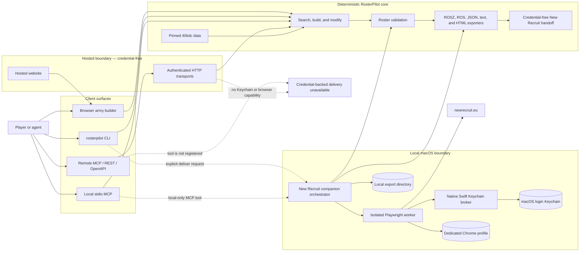
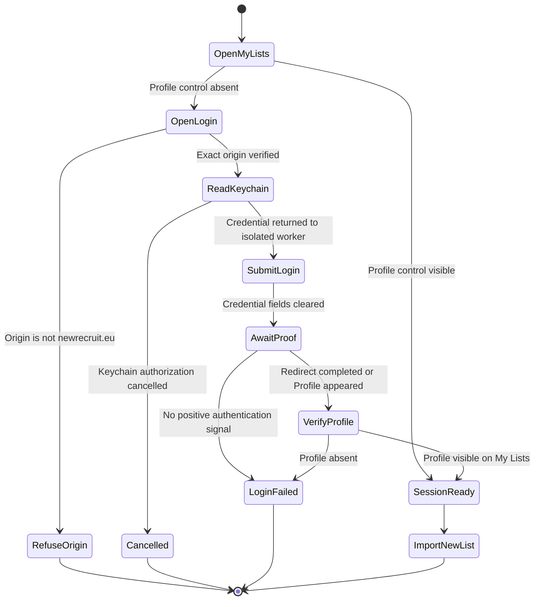
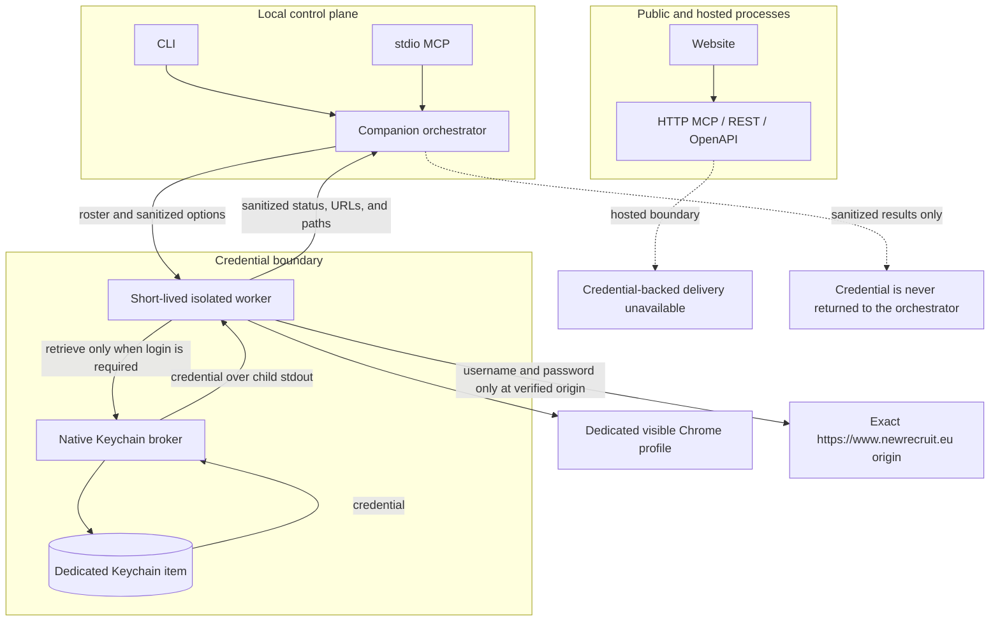

# RosterPilot architecture

RosterPilot is a deterministic Warhammer 40,000 roster engine exposed through
web, CLI, MCP, and REST surfaces. The roster engine and pinned data remain the
source of truth. New Recruit is an optional local delivery and Pretty HTML
backend, not the canonical validator.

## Capability model

Roster construction and New Recruit interoperability are deliberately separate
capabilities:

| Capability | Coverage | Authority |
| --- | --- | --- |
| Search, build, modify, validate, explain | All 35 embedded faction entries | Pinned `40kdc-data` units, detachments, pricing, loadouts, and army checks |
| Printable HTML, text, roster JSON, New Recruit-shaped JSON | Every validated roster | RosterPilot serializers |
| `.ros/.rosz` import | Factions with complete BSData catalogue mappings; currently Adeptus Custodes | Versioned catalogue, selection, model, and wargear IDs |
| New Recruit import and Pretty HTML automation | Same mapped-faction set as `.rosz` | Local macOS companion |

Space Marine chapter entries inherit the parent Adeptus Astartes unit pool while
retaining their chapter detachments, faction exclusions, and validation
context. Missing data or catalogue mappings fail closed; generic building never
implies generic New Recruit import support.

### Universal New Recruit mapping path

[New Recruit](https://www.newrecruit.eu/) states that it consumes community
catalogues from the [BSData GitHub organization](https://github.com/BSData).
RosterPilot should therefore replace hand-authored faction maps with a
versioned catalogue adapter, not scrape the New Recruit UI or call private
APIs:

1. Pin a BSData repository and commit whose game-system edition matches
   RosterPilot's pinned rules dataset.
2. Parse `.gst` and `.cat`/`.catz` files into a local catalogue index.
3. Match entities by faction, normalized name, role, composition, and wargear
   signatures rather than by name alone.
4. Materialize a reviewed mapping manifest containing the source commit and
   catalogue revision identifiers.
5. Round-trip one golden `.rosz` per faction and reject unresolved or ambiguous
   mappings.
6. Enable automated New Recruit delivery for a faction only after those checks
   pass in CI.

The active public
[`BSData/wh40k-10e`](https://github.com/BSData/wh40k-10e) repository contains
catalogue identifiers for 10th Edition, but those identifiers must not be mixed
with RosterPilot's pinned 11th Edition data. Until a matching source is pinned,
universal HTML/JSON export is safe while New Recruit delivery remains gated.

## System architecture



The hosted website and HTTP transports never receive New Recruit credentials
and cannot invoke the local browser worker. Only the terminal CLI and local
stdio MCP can reach the macOS companion.

## Roster delivery workflow

Automated delivery is a non-idempotent external action. It runs only after an
explicit request to upload, import, or send a roster to New Recruit.

```mermaid
sequenceDiagram
    autonumber
    actor User
    participant Client as CLI or local MCP
    participant Core as RosterPilot core
    participant Companion as Local companion
    participant Worker as Isolated worker
    participant Broker as Keychain broker
    participant Keychain as macOS Keychain
    participant Chrome as Dedicated Chrome
    participant NR as New Recruit
    participant Disk as Export directory

    User->>Client: Deliver this roster to New Recruit
    Client->>Core: Validate canonical roster draft
    alt Roster is invalid
        Core-->>Client: Violations and warnings
        Client-->>User: Stop before browser launch
    else Roster is valid
        Core-->>Companion: Validated roster and expectations
        Companion->>Core: Generate ROSZ in private temp directory
        Companion->>Companion: Preflight paths and file collisions
        Companion->>Worker: ROSZ path plus expected name, faction, points, and units
        Worker->>Chrome: Open My Lists in dedicated profile

        alt Authenticated Profile control is visible
            Chrome-->>Worker: Reuse authenticated session
        else Session is unverified or anonymous
            Worker->>Broker: Retrieve configured credential
            Broker->>Keychain: Restricted generic-password read
            Keychain-->>Broker: Credential
            Broker-->>Worker: Credential in worker memory only
            Worker->>NR: Submit only on exact newrecruit.eu origin
            NR-->>Worker: Redirect or authenticated Profile control
            Worker->>Worker: Clear credential fields in memory
        end

        Worker->>NR: Import ROSZ as a new list
        NR-->>Worker: New row or list URL
        Worker->>NR: Open imported list
        Worker->>Worker: Verify name, faction, points, and every unit count

        alt Verification fails
            Worker-->>Companion: Mismatch plus preserved list URL
            Companion-->>Client: Fail closed; do not delete or modify the list
        else Verification succeeds
            opt Pretty HTML requested
                Worker->>NR: Export, Pretty, Save as HTML
                NR-->>Worker: HTML download
                Worker->>Worker: Verify non-empty download
            end
            Worker-->>Companion: Sanitized result and artifact paths
            Companion->>Disk: Move ROSZ and HTML with no-overwrite rules
            Companion-->>Client: List URL, verification, artifacts, and warnings
            Client-->>User: Completed delivery
        end
    end
```

## Authentication state machine

RosterPilot proves authentication positively. The absence of a login form is
not enough because New Recruit supports anonymous local lists. A session is
reusable only when the authenticated `Profile` control is visible.



## Trust boundaries and secret flow



Security invariants:

- Credentials are collected only by the native secure dialog.
- Credentials never appear in CLI arguments, environment variables, MCP
  payloads, logs, screenshots, diagnostics, or exported files.
- Only the isolated worker invokes the broker's credential retrieval command.
- The worker enters credentials only after exact-origin verification.
- The automation does not inspect cookies or browser storage and does not call
  private New Recruit APIs.
- Login pages are never captured in screenshots.
- Hosted transports do not expose credential-backed delivery tools.

## Component map

| Component | Responsibility | Primary source |
| --- | --- | --- |
| Roster engine | Search, build, modify, validate, explain, export | `lib/rosterpilot/` |
| Local CLI | Terminal commands and local file operations | `cli/rosterpilot.ts` |
| MCP server | Shared roster tools plus conditionally registered local tools | `mcp/server.ts` |
| Local stdio MCP | Injects local file writers and macOS companion | `mcp/stdio.ts` |
| Companion orchestrator | Validation, temp ROSZ, collisions, worker lifecycle, artifacts | `local/new-recruit/companion.ts` |
| Browser adapter | Authentication, import, verification, Pretty export | `local/new-recruit/browser.ts` |
| Isolated worker | Holds credentials in memory and returns sanitized results | `local/new-recruit/worker.ts` |
| Keychain broker | Native secure configuration and restricted credential access | `native/NewRecruitKeychainBroker.swift` |
| Hosted API | Credential-free REST and remote handoff | `app/api/v1/[...path]/route.ts` |
| Browser UI | Local draft history and credential-free exports | `app/page.tsx` |

## Failure behavior

The companion fails closed:

- invalid rosters stop before Chrome opens;
- missing companion, browser, or credential stops before import;
- unverified authentication stops before import;
- changed selectors or import failures return explicit error codes;
- verification mismatches preserve the newly created list and its URL;
- download failures preserve the verified imported list;
- file collisions never overwrite existing artifacts unless explicitly
  authorized;
- failed imports are never automatically deleted or retried as mutations.

Normal CI uses fake brokers and a local fixture site. Real-site end-to-end
testing is opt-in and must never contain a real credential.
