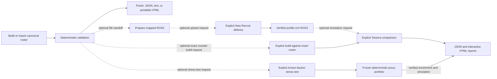
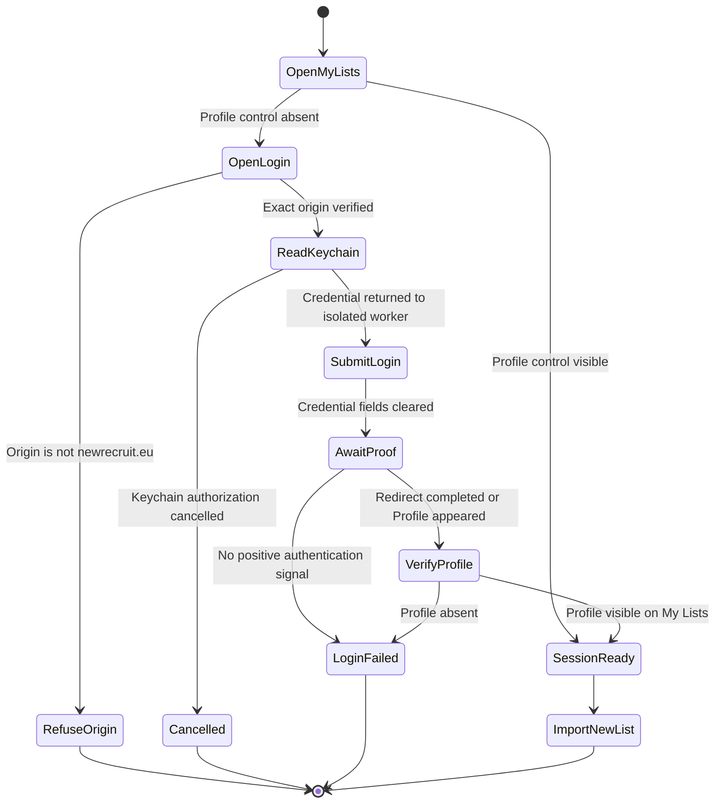
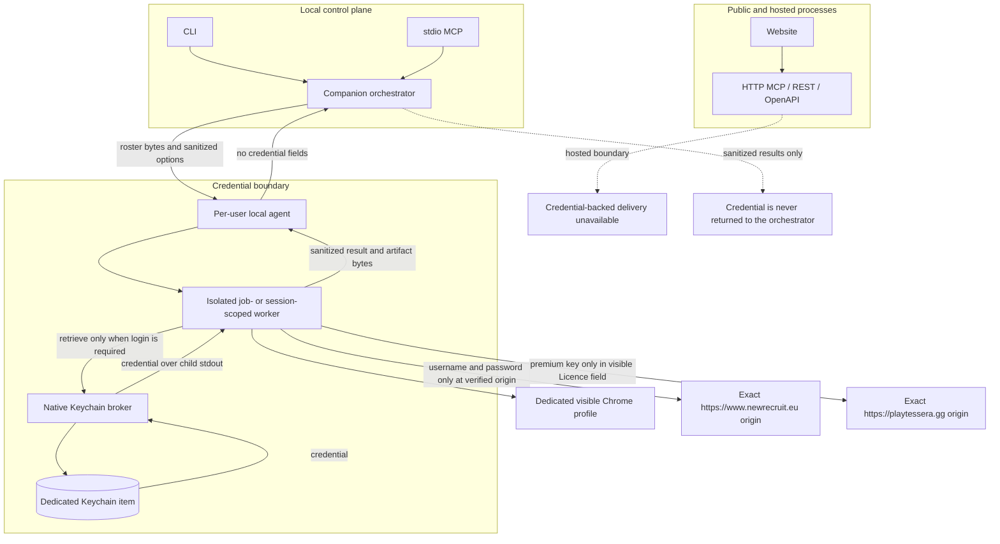

# RosterPilot architecture

RosterPilot is a deterministic Warhammer 40,000 roster engine exposed through
web, CLI, MCP, and REST surfaces. The roster engine and pinned data remain the
source of truth. New Recruit is an optional local delivery and Pretty HTML
backend, not the canonical validator. The task-oriented entry points and
commands are documented in the [workflow guide](workflows.md).

## Capability model

Roster construction and New Recruit interoperability are deliberately separate
capabilities:

| Capability | Coverage | Authority |
| --- | --- | --- |
| Search, build, modify, validate, explain | All 35 embedded faction entries | Pinned `40kdc-data` units, detachments, pricing, loadouts, and army checks |
| Printable HTML, text, roster JSON, New Recruit-shaped JSON | Every validated roster | RosterPilot serializers |
| `.ros/.rosz` import | Any roster whose selected BSData configuration, units, models, and wargear are mapped without a blocking conflict | Generated, versioned catalogue references |
| New Recruit import, enriched `.rosz`, and Pretty HTML automation | Same per-roster gate as `.rosz` | Local macOS companion |
| Tessera handoff and experimental matchup matrix | Verified New Recruit-enriched rosters | Local temporary browser adapter |
| Known-faction stress testing | A validated player roster plus deterministic legal, exportable faction proxies within points tolerance | Shared portfolio and mission-readiness core, local New Recruit enrichment, and local Tessera adapter |
| Exact-aware roster construction | A validated canonical opponent roster plus player build constraints and optional owned-model quantities | Shared roster engine, exact opponent threat profile, deterministic repair, and exact Tessera adapter |
| Durable Tessera jobs | Exact, stress, build-and-stress, and build-and-analyze requests on local CLI or stdio MCP | Persistent job document, local-agent-owned detached worker, retained result bundle, and stress manifest where applicable |

### Workflow composition

Capabilities compose, but user workflows never continue implicitly. A legal
canonical roster can be the final result, an input to a file export, an input
to an explicitly requested New Recruit delivery, the player side of an exact
Tessera comparison, the player side of a known-faction stress test, or the
opponent-aware input to an explicitly requested counter-build.



The dotted edges are explicit choices, not automatic transitions. Tessera has
a technical dependency on New Recruit enrichment, but creating or exporting a
roster does not trigger that dependency. Exact comparison and faction stress
testing are also separate explicit choices. Counter-building uses the supplied
canonical opponent rather than silently reducing it to a faction heuristic.
Comparison suggestions never mutate a canonical roster.

Space Marine chapter entries inherit the parent Adeptus Astartes unit pool while
retaining their chapter detachments, faction exclusions, and validation
context. Missing or ambiguous data fails closed for New Recruit exports;
generic building never implies that every possible selection in that faction
is mapped.

### Pinned data and New Recruit compatibility

[New Recruit](https://www.newrecruit.eu/) states that it consumes community
catalogues from the [BSData GitHub organization](https://github.com/BSData).
RosterPilot therefore consumes the public
[`BSData/wh40k-11e`](https://github.com/BSData/wh40k-11e) repository at an
exact commit. It does not scrape the New Recruit UI or call private APIs.

`data/sources.json` is the reviewed release manifest. It pins the rules package,
the BSData branch and commit, and the official Munitorum Field Manual app
version and content hash. `scripts/sync-bsdata.ts` resolves catalogue imports,
configuration trees, units, models, wargear, and enhancements, then writes the
deterministic `data/generated/new-recruit-catalogues.json` overlay.

Roster export decomposes each validated unit-wide equipment bag with the same
exact model-composition solver used by `40kdc-data` legality checks. The shared
New Recruit resolver then maps each leader, regular model, specialist, and
loadout variant to one BSData model entry. Catalogue generation runs every
deterministic base loadout through that resolver and separately indexes legal
equipment absent from BSData, so preflight and runtime export cannot disagree
about a selection they both claim to support.

The rules engine remains authoritative for construction and validation. BSData
is authoritative for New Recruit identifiers and is a cross-check for points
and loadouts. A disagreement becomes a structured conflict:

- roster validation warns about conflicts affecting selected units;
- `.ros/.rosz` and automated delivery block when a selected reference is
  missing, ambiguous, or conflicting;
- printable and canonical JSON exports remain available for a legal roster;
- unresolved mappings are never guessed.

Schema-v2 conflicts include a stable `rootCauseKey`, exact selection scope,
catalogue revision/path evidence, and a remediation owner. `source: "bsdata"`
means the pinned catalogue selection is absent, ambiguous, or differs from the
authoritative rules value; it does not claim the upstream project is at fault.
`source: "reconciler"` means RosterPilot cannot yet evaluate the catalogue
structure safely. Reports show both raw occurrences and unique root causes so
shared Space Marine data does not inflate the engineering backlog.

Each V2 roster stores the complete release provenance. V1 roster JSON is
migrated on read and marked with incomplete historical provenance.

### Tessera boundary

Tessera is not a rules authority or roster validator. RosterPilot imports and
verifies the canonical roster in New Recruit, downloads New Recruit's
profile-rich `.rosz`, and treats that archive as the stable handoff contract.
The optional Tessera adapter runs only through local stdio MCP or CLI in a
temporary Chrome profile. It does not call private APIs or read browser
storage. The orchestrator never handles premium keys: only the isolated,
session-scoped Tessera worker may retrieve the dedicated Keychain item. The key
stays only in that worker's memory, and the worker enters it only after
verifying the exact Tessera origin and locating its visible Licence key field.

Opponent scope selects one of three non-overlapping routes:

- exact comparison accepts one canonical opponent roster or one `.rosz`;
- known-faction stress freezes deterministic legal proxies for an unknown
  exact list;
- exact-aware construction derives a versioned threat profile from one
  validated canonical opponent's selected model counts, points, tags, and
  vehicle/monster keywords, fingerprints its complete payload, builds and
  repairs the player roster, then invokes exact comparison.

The exact route does not accept faction archetypes. A CLI request that supplies
only `--opponent-faction` to exact analysis fails with
`OPPONENT_SCOPE_REQUIRED` and directs the caller to stress testing. No route
guesses a faction when both exact and faction scope are absent.

Exact-aware construction defaults to a collection profile of
`{ "mode": "open-catalog" }`, which leaves the full eligible build-supported
player catalogue available under the ordinary build constraints and is labeled
as such in the result. An `owned` profile is a closed allow-list of unit IDs
with optional `maxUnits` and aggregate `maxModels` limits. Units omitted from
it are unavailable. The readiness gate requires 98% points utilization and a
non-red overall mission-readiness band unless the caller explicitly accepts
the warning. Candidate revisions remain authorization-gated suggestions.

An exact-list full analysis captures 16 raw scenarios per opponent: two phases,
four metrics, and both directions. Quick mode captures Shooting wipe
probability in both directions. The adapter confirms each visible phase and
metric selection, records the iteration count and settings, maps repeated unit
names to stable roster instances, and consolidates metric matrices into
phase/direction scenarios. Each raw table is fingerprinted from its headers,
dimensions, and values for provenance. A control transition is accepted only
after the requested exclusive state is visible, the table node is replaced or
its matrix subtree mutates, and the resulting table is stable for three reads.
The numeric fingerprint may remain equal across controls or distinct proxy
payloads; equality alone is not evidence of stale UI. A control transition
without a matrix refresh is stale and remains available only as diagnostic
evidence. Duplicate simulation payloads are rejected separately before any
browser work.

A known-faction stress test freezes a deterministic proxy portfolio before any
browser work. `core-3` is posture-first: it requires distinct
balanced-control, ranged-pressure, and assault-pressure proxies. Their
composition labels describe the generated rosters and help maximize feasible
diversity, but repeated labels do not reduce core coverage. `diverse-9` crosses
those three postures with the stable `mixed`, `mass`, and `elite-heavy` wire
labels. These are release-bound faction- and posture-relative threat lenses
rather than universal composition quotas. The v6 generator measures model
density, points per model, Infantry and Vehicle/Monster share, selected-weapon
ranged/melee pressure, mobility, role breadth, and largest-unit concentration.
Each portfolio hashes the observed faction/posture ranges and records whether
they are generated-pending-review or human-reviewed against that exact data
release; horde-tag share is context, not a gate. Proxies must be legal, New
Recruit-exportable, within the same 5%
points tolerance, and distinct by a simulation-payload fingerprint over units,
models, equipment, enhancements, and only modeled rules. Detachment-only
differences do not count. `core-3` requires three unique simulation
fingerprints and all three postures. Available proxies have equal analytical
weight; they are coverage cases, not an empirical distribution of tournament
lists.

The portfolio preview surface runs this construction and exportability
preflight locally and exposes fingerprints, composition evidence, coverage
cells, named-anchor status, and profile requirements without invoking New
Recruit or Tessera.

The explicit full-loop adapter first builds with structured opponent context
and mixed-threat intent, runs a bounded deterministic repair, then stops unless
the roster uses at least 98% of its points and has no red overall mission
readiness result. The escape hatch is explicit. It assigns a stable descriptive
name and never applies post-simulation changes.

Stress preflight validates the player, locally verifies `.rosz` export for all
available proxies, reserves report and manifest paths, and scans known
multi-profile equipment before starting an external action. Unresolved choices
produce a policy scaffold and `TESSERA_PROFILE_POLICY_REQUIRED`; no list is
delivered. A `ProfilePolicyV1` entry binds faction, unit, weapon group, phase,
selected profile, and active count. The enriched archives are checked against
the complete inventory and the policy's canonical SHA-256 is frozen into the
execution fingerprint, manifest, report provenance, and paired revision. An
enriched-only decision is persisted before simulation; a completed replacement
policy may be adopted only while the manifest has zero Tessera attempts, so
resume can reuse the verified New Recruit artifacts without weakening paired
provenance.

The default `diverse-9` staged strategy screens every available proxy with
half-wipe probability for both phases and directions. It waits until every
required screen is complete, confident, and integrity-clean before selecting
and freezing the stress, central, and contrast representatives for the other
three metrics. Deep dives therefore never race a changing screening set. A
complete `diverse-9` staged run captures 72 raw scenarios. `core-3` defaults to
`full-all`: every ready proxy is necessarily a representative, so one full
browser pass per proxy preserves the same required 48-scenario evidence while
avoiding a redundant second browser setup pass. An explicitly requested staged
core run remains supported for recovery testing. `full-all` applies all four
metrics to every proxy, producing 144 raw scenarios for a complete diverse
suite.
Tessera simulation requires `executionMode: "simulate"`; prepare-only returns
verified handoffs with `status: prepared` and no inferred cells. The legacy
`experimental` option is a deprecated compatibility alias.

Stress report schema v3 and manifest schema v3 record the player fingerprint and data
pin, profile-policy hash, opponent faction, the complete frozen portfolio and
its canonical SHA-256, configuration,
prepared-artifact hashes, representative selection, and every stage's status,
attempt count and history, timestamps, structured error, retryability, next
action, report path, and content hash. Resume revalidates identity, requested
cells, exact profile policy, and hashes. V1 and V2 manifests are migrated in
memory and rewritten as v3 on resume. V1 paired baselines without exact profile
provenance are rejected. Transient entries receive at most three automatic
attempts with one- and three-second backoff and five lifetime attempts through
explicit resume; terminal errors require an explicit forced retry within that
same ceiling.

Before any New Recruit delivery, the manifest persists an in-progress marker.
The verified receipt and enriched-file hash replace it after delivery. If the
process stops in that narrow interval, resume reports an unknown external
outcome and fails closed instead of risking a duplicate list. Resume also
rejects a changed fingerprint, data pin, faction, suite, strategy, or
simulation setting. This prevents a resumed result from silently mixing
incomparable runs.

`resumeManifestPath` (CLI `--resume`) continues the same run ID and attempt
history. Once its five-attempt budget is exhausted, `restartManifestPath` (CLI
`--restart-from`) requires a different output directory and creates a new
manifest, run ID, and empty simulation stages. A restart carries forward the
frozen portfolio, policy, and only those prepared New Recruit artifacts whose
identities and hashes still verify; the source manifest is never rewritten.
Resume and restart are mutually exclusive.

For client calls that cannot remain open, the local durable-job layer writes a
`tessera-run.json` document before asking the current local agent to launch a
detached worker. It supports exact, stress, build-and-stress,
build-and-analyze, exact paired revision, and stress paired revision requests
and exposes
queued, running, needs-input, complete, degraded, inconclusive, failed, and
cancelled states. Status can include the retained result. Profile resolution
is allowed only while stopped, freezes a validated policy in the job bundle,
and requires a subsequent resume. External stress-manifest v1/v2/v3 recovery
is copied into the run bundle, verified, and migrated to portable v3 before it
is adopted; subsequent recovery uses only the shared durable job. Exact jobs
freeze and reverify prepared player and
opponent archives for zero-redelivery resume; `restart-from` copies those
archives into the new run but starts simulation evidence from a clean stage.
Exact simulation remains one analytical stage rather than claiming the stress
workflow's per-opponent screening/deep-dive checkpoints. The job manifest freezes
request, data-pin, policy, runtime, artifact, and per-attempt provenance.
Runtime evidence records the observed macOS, Node, Chrome/Playwright and broker
versions, the required local-agent protocol/version, the actual status
response and observed launchd process identity, MCP source build identity, and
pinned data release/freshness
timestamps; unavailable observations remain `null`. Its
first three attempts are automatically scheduled for retryable failures by
the outer job coordinator. Stress stages make at most one attempt per outer
attempt, so attempts four and five require explicit resume. Five is the
lifetime ceiling.
Explicit restart-from opens a new run and simulation stage using only
hash-verified frozen inputs; it never carries prior simulation evidence.
Cancellation stops the local-agent-owned worker
without deleting job state, artifacts, inventory entries, or remote New
Recruit lists.

Matchups at or below a 5% difference relative to the player's points limit are
classified as matched. Exact opponents outside that inclusive tolerance fail
closed unless `allowPointMismatch` is explicit; an overridden report is
classified as unmatched and cannot produce roster-change candidates.
Out-of-tolerance generated archetypes are omitted.

Schema-v2 reports retain visible Tessera settings, import warnings, structured
findings with cell-level evidence, and up to three validated single-operation
change candidates for matched comparisons. Candidate qualification requires a
legal and New Recruit-exportable result, at least 98% points utilization, no
mission-readiness regression, and evidence tied to the affected player unit or
a role gap. A unit classified as a reliable or portfolio-wide robust answer is
not offered as a replacement; testing such an alternative requires a
separately authorized paired revision. An empty candidate set is preferred to
an underfilled roster. Candidates never mutate a roster. Import issues carry
side, unit, weapon group, phase, and profile choices; only the affected
attacking unit's cells are ambiguous.
After explicit approval, `compare_roster_revision` validates a same-faction
revision, reuses the baseline opponents and configuration, and records
improved, worsened, unchanged, or ambiguous cell deltas.

Faction stress reports are schema v3. `prepared` means external preparation
completed without a simulation request. `failed` means requested simulation
did not produce trusted evidence. `inconclusive` means some evidence exists
but confidence or integrity is insufficient. `degraded` permits at least six
execution-distinct exportable proxies across all three postures only when every
other requested composition cell is in the faction's release-bound
reviewed-not-applicable contract; only all nine cells can be `complete`.
Missing estimates are `null`, while below-threshold
observations live in a separate `provisional` structure with explicit point
coverage. Reports summarize directional combat robustness, never whole-game
win probability. Mission readiness remains separate.

After explicit approval, `compare_stress_test_revision` requires the same
player faction, points limit, and pinned data release. It reuses the exact
baseline enriched proxy files, portfolio, analysis strategy, simulator
configuration, and representative selections; it never regenerates or
reselects the opposing suite. Before revised-player delivery it verifies every
proxy's execution fingerprint and SHA-256 content hash. After the rerun it
actively reapplies and then requires identical recorded settings and iteration
counts for each exact phase/metric/direction scenario, not merely matching
stage-level totals. Margin changes smaller than one percentage point are
classified as unchanged. The
paired conclusion uses the screening half-wipe robustness deltas; deep-dive
wipe, kill, and damage results remain supporting evidence. The conclusion is
suppressed if the mission-readiness guardrail detects a regression.

If UI automation is disabled or an individual Tessera run fails, verified
enriched artifacts remain usable and the report is `partial`, with missing
scenarios and warnings kept visible. Reports describe modeled damage
efficiency and unit threats, never a whole-game win probability. Hosted MCP,
REST, OpenAPI, and the public website do not register exact-matchup or
stress-test browser tools. Faction stress testing is available only through
the terminal CLI and local stdio MCP; there is no public stress-test UI.

Verified New Recruit artifacts are stored in a local content-addressed cache
keyed by execution fingerprint and pinned source data. Reuse requires both the
file hash and exact enriched summary to match. Remote list URLs are retained in
a local run inventory and are never deleted automatically. A stress run also
reuses one isolated, session-scoped Tessera worker across its proxy requests.
That worker owns one live browser context and keeps the premium key only in
memory. Explicit session close or seven days of inactivity removes its
user-only browser profile. Local-agent shutdown closes the worker and context
but retains that `0700` run profile so a verified resume can select exact
existing Tessera lists after restart. Transient browser, session, or navigation
failures reset the context without deleting the profile before a later attempt.
Premium unlock retains the key through a bounded positive-state poll, and
absence, rejection, timeout, still-locked UI, missing/stale matrix, and
incomplete scenario failures have distinct codes.

The local manifest is the recovery record and may contain absolute paths.
Shareable JSON and HTML use relative artifact references so the output bundle
can be relocated. Remote New Recruit list URLs remain only in the local
manifest/inventory and are removed from shareable reports. Terminal progress
is emitted on stderr; stdout is a compact
summary with status explanation, portfolio and integrity state, recovery
state, representatives, and the full report path. The complete nested result
is opt-in through `--full-json`.

### Freshness policy

Reproducibility and freshness are separate checks. An army is always built from
the exact pinned release; a live source check never changes points in the
middle of a build.

- Doctor runs local prerequisites, agent/browser status, committed-data
  validation, and engine status independently. With `--refresh skip` it makes
  no network-backed source check. With `--refresh check`, pinned-source
  synchronization and live freshness are separate warning-class results, so
  an offline source cannot hide a local readiness failure.
- MCP and authenticated REST builds check the npm package, BSData branch head,
  and official points app through a 15-minute cache.
- The browser checks the same server-side freshness endpoint on startup and
  after generating an army.
- `check_data_freshness` and `rosterpilot freshness` expose an explicit live
  check.
- A daily GitHub workflow prepares a reviewable pull request when a source
  changes. It stages the package pin, generated overlay, and synchronized
  certification manifest together; then it runs data, representative ROSZ,
  and browser-free portfolio certification before publishing any file. The
  local publisher uses an exclusive lock and durable recovery journal so a
  caught failure rolls back immediately and the next update detects and
  restores an interrupted publish. The workflow does not merge itself.

## System architecture


The hosted website and HTTP transports never receive New Recruit credentials
and cannot invoke the local browser worker. Terminal CLI and local stdio MCP
send high-level jobs to the per-user agent. Sandboxed clients fall back to an
atomic, per-user file queue under `/private/tmp`; neither transport has a
credential-retrieval operation.

## Roster delivery workflow

Automated delivery is a non-idempotent external action. It runs only after an
explicit request to upload, import, or send a roster to New Recruit.

```mermaid
sequenceDiagram
    autonumber
    actor User
    participant Client as CLI or local MCP
    participant Core as RosterPilot core
    participant Companion as Local companion
    participant Worker as Isolated worker
    participant Broker as Keychain broker
    participant Keychain as macOS Keychain
    participant Chrome as Dedicated Chrome
    participant NR as New Recruit
    participant Disk as Export directory

    User->>Client: Deliver this roster to New Recruit
    Client->>Core: Validate canonical roster draft
    alt Roster is invalid
        Core-->>Client: Violations and warnings
        Client-->>User: Stop before browser launch
    else Roster is valid
        Core-->>Companion: Validated roster and expectations
        Companion->>Core: Generate ROSZ in private temp directory
        Companion->>Companion: Preflight paths and file collisions
        Companion->>Worker: ROSZ path plus expected name, faction, points, and units
        Worker->>Chrome: Open My Lists in dedicated profile

        alt Authenticated Profile control is visible
            Chrome-->>Worker: Reuse authenticated session
        else Session is unverified or anonymous
            Worker->>Broker: Retrieve configured credential
            Broker->>Keychain: Restricted generic-password read
            Keychain-->>Broker: Credential
            Broker-->>Worker: Credential in worker memory only
            Worker->>NR: Submit only on exact newrecruit.eu origin
            NR-->>Worker: Redirect or authenticated Profile control
            Worker->>Worker: Clear credential fields in memory
        end

        Worker->>NR: Import ROSZ as a new list
        NR-->>Worker: New row or list URL
        Worker->>NR: Open imported list
        Worker->>Worker: Verify name, faction, points, and every unit count

        alt Verification fails
            Worker-->>Companion: Mismatch plus preserved list URL
            Companion-->>Client: Fail closed; do not delete or modify the list
        else Verification succeeds
            opt Pretty HTML requested
                Worker->>NR: Export, Pretty, Save as HTML
                NR-->>Worker: HTML download
                Worker->>Worker: Verify non-empty download
            end
            Worker-->>Companion: Sanitized result and artifact paths
            Companion->>Disk: Move ROSZ and HTML with no-overwrite rules
            Companion-->>Client: List URL, verification, artifacts, and warnings
            Client-->>User: Completed delivery
        end
    end
```

## Authentication state machine

RosterPilot proves authentication positively. The absence of a login form is
not enough because New Recruit supports anonymous local lists. A session is
reusable only when the authenticated `Profile` control is visible.



## Trust boundaries and secret flow



Security invariants:

- Credentials are collected only by the native secure dialog.
- Credentials never appear in CLI arguments, environment variables, MCP
  payloads, logs, screenshots, diagnostics, or exported files.
- Only an isolated worker invokes the broker's credential retrieval command.
  New Recruit workers are job-scoped; Tessera workers are session-scoped and
  discard the in-memory key when the session closes or expires.
- The local-agent protocol accepts roster jobs and status checks, never a raw
  credential retrieval request.
- The New Recruit worker enters credentials only after exact-origin
  verification. The Tessera worker similarly enters the premium key only into
  Tessera's visible Licence key field on the exact Tessera origin.
- The automation does not inspect cookies or browser storage and does not call
  private New Recruit APIs.
- Login pages are never captured in screenshots.
- Hosted transports do not expose credential-backed delivery tools.

## Component map

| Component | Responsibility | Primary source |
| --- | --- | --- |
| Roster engine | Search, build, modify, validate, explain, export | `lib/rosterpilot/` |
| Catalogue generator | Pin and reconcile BSData identifiers, coverage, and conflicts | `scripts/sync-bsdata.ts` |
| Freshness monitor | Compare pins with npm, BSData, and the official MFM app | `lib/rosterpilot/freshness.ts` |
| Stress-test core | Generate deterministic faction portfolios, structural fingerprints, and mission-readiness guardrails | `lib/rosterpilot/stress-portfolio.ts`, `lib/rosterpilot/mission-readiness.ts` |
| Local CLI | Terminal commands and local file operations | `cli/rosterpilot.ts` |
| MCP server | Shared roster tools plus conditionally registered local tools | `mcp/server.ts` |
| Local stdio MCP | Injects local file writers and macOS companion | `mcp/stdio.ts` |
| Per-user local agent | Cross-process queue, provider status, checkout identity, and secret-free roster job transport | `local/agent/server.ts` |
| Companion orchestrator | Validation, collisions, local-agent requests, and artifact publication | `local/new-recruit/companion.ts` |
| Browser adapter | Authentication, import, verification, Pretty export | `local/new-recruit/browser.ts` |
| Tessera orchestrator | Exact matchups, matched-points policy, scenario consolidation, findings, candidates, and exact-list revision deltas | `local/tessera/companion.ts` |
| Exact-aware build loop | Validate an exact opponent, build and repair from its threat profile, enforce readiness, and invoke exact analysis | `local/tessera/exact-full-loop.ts`, `lib/rosterpilot/build-and-analyze.ts` |
| Faction stress orchestrator | Preflight, delivery reuse, staged execution, resume manifests, robustness aggregation, and frozen paired revisions | `local/tessera/stress.ts`, `local/tessera/stress-analysis.ts` |
| Durable Tessera jobs | Persist requests and results; ask the local agent to start workers; inspect, resume, resolve profiles, and cancel background runs | `local/tessera/jobs.ts`, `local/agent/server.ts` |
| Tessera UI and reports | Visible simulator control/extraction plus exact-matchup and faction-stress HTML rendering | `local/tessera/browser.ts`, `local/tessera/report.ts`, `local/tessera/stress-report.ts` |
| Isolated workers | Hold credentials in memory and return sanitized results; New Recruit is job-scoped and Tessera is session-scoped | `local/new-recruit/worker.ts`, `local/tessera/worker.ts` |
| Keychain broker | Native secure configuration and restricted credential access | `native/NewRecruitKeychainBroker.swift` |
| Hosted API | Credential-free REST and remote handoff | `app/api/v1/[...path]/route.ts` |
| Browser UI | Local draft history and credential-free exports | `app/page.tsx` |

## Installation and deployment boundaries

| Surface | Installation unit | Portability and durability rule |
| --- | --- | --- |
| Core engine, CLI, and stdio MCP | Complete Git checkout plus locked Node dependencies | Supported on macOS, Linux, and Windows; direct dependencies and package scripts must remain platform-neutral |
| Hosted website, REST, and HTTP MCP | Validated Cloudflare-compatible build | Uses only credential-free core capabilities and never imports local automation modules into a hosted tool contract |
| New Recruit and Tessera automation | Per-user macOS LaunchAgent, installed broker, and one complete checkout | Setup records the exact checkout and Node executable; status verifies checkout, protocol, build provenance, and runtime freshness |
| Roster and report artifacts | Caller-selected directory | Writes stay inside the current directory by default and never overwrite without explicit approval |

The LaunchAgent intentionally runs reviewed worker code from the checkout that
installed it, while the native broker is copied into per-user application
support. Moving the repository or changing the Node installation requires
rerunning the selected setup profile. Protocol and checkout identity checks
turn that condition into an actionable failure instead of allowing a newer CLI
to call stale background code. `agent ensure-current` also compares build
provenance and runtime staleness, then uses the existing restart or installation
lifecycle and returns both the original issues and the repair actions.

The repository CI verifies the locked install on macOS, Linux, and Windows and
runs lint, tests, a production build, rendered-output checks, and deterministic
catalogue regeneration before changes are considered ready.

## Failure behavior

The companion fails closed:

- invalid rosters stop before Chrome opens;
- a local agent from another checkout, protocol, build, or stale runtime is
  rejected with an `agent ensure-current` instruction;
- exact analysis rejects faction-only input with `OPPONENT_SCOPE_REQUIRED`
  instead of silently selecting proxy lists;
- exact-aware construction validates the opponent before building and labels
  an unconstrained result `open-catalog`; an `owned` profile is enforced as a
  quantity-aware closed allow-list;
- missing companion, browser, or credential stops before import;
- unverified authentication stops before import;
- changed selectors or import failures return explicit error codes;
- exact Tessera opponents outside the 5% points tolerance stop unless the
  caller explicitly allows an unmatched directional analysis;
- stress testing completes local validation, mapping preflight, and output-path
  reservation before browser activity; fewer than three unique `core-3` or six
  unique `diverse-9` payloads stops the run;
- unavailable faction templates and failed scenario stages remain explicit
  instead of being replaced or inferred;
- resume rejects a changed player fingerprint, data pin, faction, suite,
  strategy, or simulation setting and reuses only schema-, identity-, cell-,
  and hash-validated reports;
- an uncertain post-delivery crash fails closed instead of repeating the New
  Recruit mutation;
- incomplete Tessera phases, metrics, directions, or cells remain visible as
  partial scenarios and never become inferred values;
- revision comparison rejects invalid, wrong-faction, or incompatible
  baselines before importing the revised roster;
- stress revision comparison also verifies every frozen proxy execution
  fingerprint and content hash, verifies each phase/metric/direction scenario's
  settings and iterations, and never regenerates or reselects the baseline
  portfolio;
- verification mismatches preserve the newly created list and its URL;
- download failures preserve the verified imported list;
- file collisions never overwrite existing artifacts unless explicitly
  authorized;
- failed imports are never automatically deleted or retried as mutations.
- durable-job profile choices cannot change while a worker is active, and
  cancellation retains artifacts, inventory records, and remote lists.

Normal CI uses fake brokers and a local fixture site. Real-site end-to-end
testing is opt-in and must never contain a real credential.

## Certification boundary

`data/certification-manifest.json` is the reviewed, pinned capability contract
for every faction. The certification runner calls the shared roster engine and
exporters directly; it does not reimplement legality or mapping rules.
Deterministic, recorded-connector, and live evidence remain separate tiers.
Only the live tier may call the local New Recruit and Tessera adapters, and it
requires an explicit environment guard in addition to the command selection.

Manual faction assertions are content-bound rather than carried forward by
faction ID. Their versioned binding hashes both the complete data pin and the
canonical executable faction contract (including global roster defaults).
Manifest parsing treats an unbound legacy review as pending, and
synchronization demotes any reviewed entry whose binding no longer matches.
The old assertions remain visible only as drafts; a new expert approval is
required before they can contribute passing evidence.

Certification reports use bundle-relative artifact references, a detached
report checksum, structured capability boundaries, and durable connector
events. An expected unsupported mapping is not a product pass, while a mapping
regression, uncertain external mutation, stale runtime, or incomplete trusted
Tessera scenario set is a failure.
